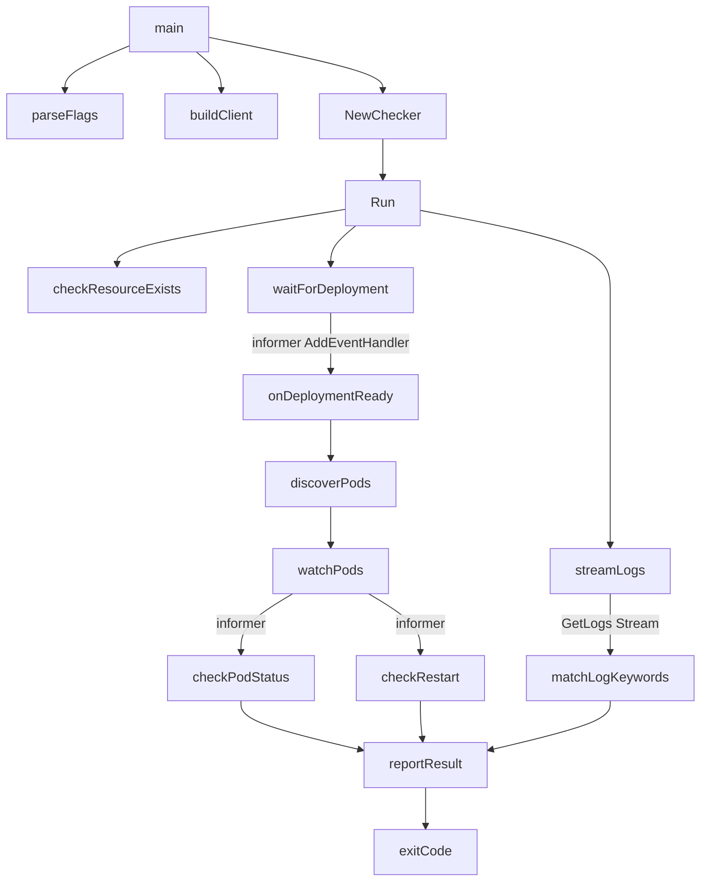

## 用户需求
依据 `kubectl-check 插件设计规格说明书SPEC.md`，开发对应的 kubectl 插件。

## 本期交付范围（规划阶段）
本期仅产出可视化设计文档，供用户审阅，暂不编写可运行插件代码：
- 生成「整体执行流程图」（Mermaid flowchart）
- 生成「函数/方法调用关系拓扑图」（Mermaid）
- 以 Mermaid 图形式写入 `.md` 文档（位于工作区根目录）

## 产品概述
`kubectl-check` 是一个基于 client-go informer 事件驱动模型的 kubectl 自定义插件，对标原生 `kubectl wait` 写法，在部署后对 Deployment 进行资源就绪校验 + Pod 长效稳定性校验 + 实时日志监控，弥补原生命令无探针场景与日志监控的盲区，并输出标准化结果与退出码。

## 核心特性（图表需覆盖）
- 双层状态校验：Deployment informer 监听 Condition（默认 Available）；Pod informer 监听状态异常、restartCount 增量、运行持续性
- 实时日志流式监控：GetLogs 长连接采集，错误/忽略关键字匹配，命中即终止
- 全生命周期超时：context.WithTimeout 全局控制（默认 5m），stable-duration 稳定窗口校验
- 参数全可配置：namespace、资源标识、--for、--timeout、--stable-duration、--max-restart、--log-* 等
- 异常终止优先级：日志报错 > Pod状态/重启超限 > 资源就绪超时 > 整体监控超时
- 标准化退出码：0/1/2/3/4/5


## Tech Stack
- 开发语言：Golang（与 kubectl、client-go 生态统一，go.mod 中 module 为 flow，go 1.25.0）
- 核心依赖：`k8s.io/client-go`、`k8s.io/api`、`k8s.io/apimachinery`（纯 K8s 官方库，复用现有 go.mod）
- 事件模型：client-go informer + SharedInformerFactory，复用本地缓存与增量事件回调
- 日志采集：`client.CoreV1().Pods(namespace).GetLogs().Stream()` 流式长连接
- 超时控制：`context.WithTimeout` 全局上下文联动所有 informer Stop 与日志流关闭
- 图表产出：Markdown + Mermaid（无需额外 Go 依赖）

## Implementation Approach
本期不写运行时代码，只产出架构图文档，因此技术重点在于：
- **准确还原 SPEC 5.1 执行流程**：参数初始化校验 → 资源存在性校验 → Deployment informer 监听 → 关联 Pod 发现与 Pod informer 注册 → 双 informer 并行 + 日志流式采集 → stable-duration 持续校验 → 注销 & 结果输出/退出
- **调用关系拓扑以 main 为根**：`main → NewChecker/Run → parseFlags → buildClient → waitForDeployment(informer) → discoverPods → watchPods(informer) → streamLogs(GetLogs) → checkCondition/checkPodStatus/checkRestart → reportResult/exit(code)`，标注各函数职责与 client-go 调用点
- **异常优先级与退出码映射**：在文档中以表格 + 流程图分支呈现，确保与 SPEC 6.2 一致

## Implementation Notes
- 图表仅做规划说明，不改动 main.go 与 go.mod 任何运行时代码；新增的文件为纯文档，不影响现有编译
- Mermaid 语法需严格（flowchart 用 `graph TD`/`flowchart TD`，节点命名避免特殊字符），确保 GitHub 等渲染器可正常显示
- 函数命名与分层（cmd 解析层 / client 构建层 / 校验层 / 日志层 / 输出层）需与后续代码阶段保持一致，避免返工

## Architecture Design
### 系统架构（规划）
- 入口层：`main` 解析参数、构建 ClientSet、构造 Checker、调用 Run
- 校验层：Deployment 就绪监听（informer AddEventHandler）+ Pod 稳定性监听（status/restartCount）
- 日志层：Pod 日志流式监听（GetLogs Stream），关键字匹配与忽略规则
- 控制层：全局 context 超时、信号（SIGINT/SIGTERM）优雅终止、informer Stop、流关闭
- 输出层：分级日志（INFO/ERROR/SUCCESS）+ 退出码

### 调用关系（Mermaid 拓扑示意）


## Directory Structure
```
//wsl.localhost/Ubuntu-22.04/root/flow/
└── kubectl-check-architecture.md   # [NEW] 架构设计文档。包含：整体执行流程图(Mermaid)、函数/方法调用关系拓扑图(Mermaid)、异常终止优先级与退出码映射说明。依据 SPEC 第3/5/6章还原，供用户审阅后进入代码阶段。
```


## Agent Extensions
### SubAgent
- **code-explorer**
  - Purpose: 在生成架构图前，跨文件核对 SPEC 文档与现有代码（main.go、go.mod）的精确结构、参数清单与执行步骤，确保图表颗粒度与后续代码一致
  - Expected outcome: 确认当前工作区无已有 k8s 代码、参数与流程以 SPEC 为准，输出可用于绘制拓扑图的准确函数清单与调用链
