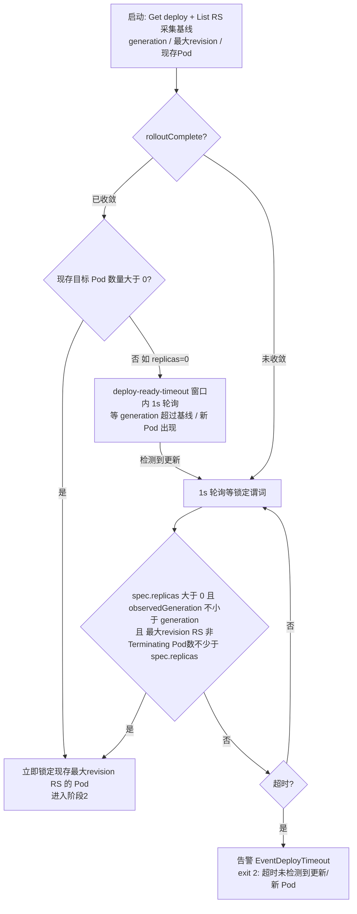
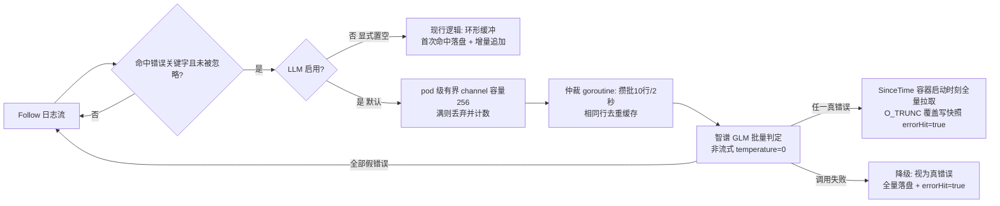

## Product Overview
kubectl-check 是部署后自动化校验的 kubectl 插件：监视 Deployment 发布、追踪目标 Pod 状态与日志，异常时告警（飞书优先，未配置降级控制台）并落盘错误日志。本次重构三阶段检查的判定逻辑，控制台输出与退出码体系（0/1/2/3/130）保持不变。

## Core Features
### 阶段1：目标锁定（替代原"滚动收敛等待"）
- 启动时采集基线，三分支处理：滚动未完成则视为更新进行中，等待新 ReplicaSet 的 Pod 名单齐备（Pending/拉镜像中也计入）；已收敛且存在 Pod 则立即检查现存最新副本组；已收敛且无 Pod（如副本数为 0）则在超时窗口内等待更新发生再等新 Pod 出现
- 超时未锁定目标 → 告警并退出（退出码 2 保留），文案改为"超时内未检测到更新/新 Pod"
- 收益：目标锁定大幅提前，慢启动应用的 Pod 早期日志不再丢失

### 阶段2：就绪判定升级
- 判定条件从"Pod 进入 Running"升级为"Pod 就绪（含就绪探针校验）"；超时未就绪仍告警并异常退出（退出码 3），文案改"未就绪"
- 无就绪探针的容器 Running 即就绪，现有正常场景行为不变

### 阶段3：日志错误智能仲裁（新增，默认启用）
- 关键字命中的日志行投入 pod 级队列，由大模型异步消费、批量判定错误真伪
- 存在任一真错误 → 以容器启动时刻为起点全量拉取日志落盘（覆盖写快照），发送"需检查"提醒（退出码 0）
- 全部为假错误 → 不落盘、不告警
- 判定服务地址/模型/密钥内置默认值（智谱 GLM），命令行不传即用默认并默认启用；显式置空服务地址才关闭，关闭后回退现行"关键字命中即落盘+告警"行为
- 判定调用失败（超时/网络/解析失败）→ 降级为真错误处理
- 容器异常退出路径不经仲裁，无条件落盘保留现场

### 保持不变
- 日志观察窗口从首次观察到 Running 的时刻起算、中断退出（130）、告警降级链路、-A 全命名空间监听模式（复用主流程自动受益）


## Tech Stack
- 复用现有栈：Go + client-go + cobra；单测用 client-go fake clientset + httptest fake LLM server；e2e 沿用 bash 脚本
- **不新增 go.mod 依赖**：LLM 客户端用标准库 net/http + encoding/json 实现 OpenAI 兼容 chat completions（智谱 v4 完全兼容）；Pod Ready 判定本地实现（等价 podutil.IsPodReady 语义，不引入 k8s.io/kubectl）

## Implementation Approach
### 总体策略
三处联动重构一次完成：阶段1 从"收敛等待"改为"目标锁定"（删除 informer，改 1s 轮询复合谓词）；阶段2 判定升级为 Ready；阶段3 引入默认启用的 LLM 仲裁链路。阶段3 观察窗口锚点（首次 Running 时刻）、中断链路、飞书告警、-A watcher 结构不动。

### 阶段1：lockTargetPods 三分支（替换 waitDeploymentReady + waitForTargetPods）

- **误锁定防护**：谓词含 observedGeneration 不小于 generation（controller 观察到最新 spec 时新 RS 必已创建，避免更新瞬间取到旧 RS）；spec.replicas 每 tick 重读，覆盖 scale 场景（e2e C3：scale 递增 generation 但不建新 RS）；replicas 为 0 时守卫避免空名单误判齐备
- **超时归属**：--deploy-ready-timeout = 阶段1 目标锁定整体窗口（不超过 0 沿用"立即单次判定"）；--pod-ready-timeout 专用于阶段2 等 Ready
- 等待 ctx 经 registerCancel 登记，中断立退；保留 rolloutComplete/isRolloutComplete/logDeploymentStatus 用于启动收敛判定与 verbose 日志；listTargetPods 拆出 newestReplicaSet helper 供轮询复用；--check-pod-status=false 分支移到目标锁定之后

### 阶段2：waitPodRunning → waitPodReady
- 本地 podReady helper：Status.Conditions 中 Type 为 PodReady 且 Status 为 ConditionTrue
- runningAt 锚点保留"首次观察到 Phase 为 Running 的时刻"（首次即 Ready 则取当前时刻）返回，watchPodLog 签名与"从 Running 时刻计时"语义不动
- 超时告警文案"未进入 running"改为"未就绪（Ready 超时 N 秒）"，仍 setPodFailure → exit 3

### 阶段3：LLM 仲裁（核心新增，默认启用）

- **GLM 默认值（用户指定）**：endpoint `https://open.bigmodel.cn/api/paas/v4/chat/completions`、model `GLM-4-Flash-250414`、api-key `d8c44eb30f4a4ec4a2db213aa480448c.W0hKnAJ7jeBoYoRN` 作为 flag 默认值；Enabled() 判定 endpoint 非空 → 默认启用，显式 --llm-endpoint="" 才禁用（回退现行行为，与现状逐字节一致）
- **调用适配**：非流式（不带 stream 参数，解析 choices[0].message.content，比 SSE 拼接简单可靠）；temperature=0（判定任务确定性优先，示例中 1.0 是控制台默认值）；system prompt 在用户原义基础上做批量适配：
```
你是容器日志判断专家。用户输入多行日志（JSON 数组），逐行判断是否为真实报错，
只允许返回 JSON：{"results":[{"is_error":true},{"is_error":false},...]}，长度与输入行数一致
```
- **全量拉取**：PodLogOptions 带容器启动时间（State.Running.StartedAt，已退出取 LastTerminationState.Terminated.StartedAt，回退 Pod 创建时间）逐容器拉取，首容器 O_TRUNC 后续容器追加；同 Pod 后续新真错误重新拉全量覆盖更新快照
- **降级语义**：未启用 → 完整走现行缓冲+首次命中落盘逻辑；启用但调用失败（超时/网络/解析失败）→ 该批视为真错误走全量落盘
- **告警门槛**：TrackLog 返回 hit 语义变为"存在真错误（或降级命中）"，checker 的 setWarning 与场景3 提醒只在真错误时触发
- **容器异常退出**：不经 LLM 无条件落盘保留现场（LLM 模式用 SinceTime 全量，非 LLM 模式沿用缓冲 flush）
- **生命周期**：全部容器流结束后 close(channel)，仲裁 goroutine 最终 flush；TrackLog 内等待在途判定完成（上限 2×llm-timeout）；waitLogFlush 兜底上限 LLM 启用时调整为 2×llm-timeout+5s；中断 cancel 后仲裁退出不落盘
- **新参数**：--llm-endpoint（默认智谱地址，空串禁用）/--llm-model（默认 GLM-4-Flash-250414）/--llm-api-key（默认内置 key）/--llm-timeout（默认 15s）

### e2e 影响
- run_tool（e2e-test.sh:81-86）与 c3/c6/c7 的后台启动命令全部追加 --llm-endpoint= 显式禁用（否则真实调用云端 API：断言不确定、消耗配额）
- C2 探针失败：exit 2 → exit 3（阶段2 Ready 超时捕获）；新增 replicas=0 且不 scale 用例验证 exit 2 新语义；C3 断言关键字"未进入 running"改"未就绪"
- C1/C4/C5/C8~C13 在禁用 LLM 下行为不变；LLM 仲裁逻辑靠单测（httptest fake server 覆盖成功/超时/解析失败/批量拆分/默认值透传 + fake clientset 断言 SinceTime 透传），e2e 不起真实 LLM（可选手动 smoke 不进脚本）

## Implementation Notes
- **性能**：阶段1 轮询 1s×(Get deploy+List RS+List pods) 开销可忽略；LLM 异步消费不阻塞日志流；攒批+去重控制调用量，单批不超过 20 行超限拆分；窗口结束最多追加 2×llm-timeout 等待
- **日志**：verbose 输出仲裁结论、丢弃行计数、全量拉取路径；WARN 记录降级原因；绝不打印 api key
- **安全**：api key 硬编码进源码，仓库公开有泄露风险，README 提示轮换与改用命令行覆盖；日志行会发送至云端 endpoint，文档提示敏感日志场景应指向内网兼容端点
- **爆炸半径**：默认启用改变了"未配置即禁用"语义（禁用需显式置空）；退出码 0/2/3/130 语义不变；已知语义变化：探针失败从 exit 2 变 exit 3、scale-to-0 的"未产生 Pod exit 3"并入 exit 2

## Architecture Design
- 分层不变：cmd（参数/编排）→ checker（三阶段状态机）→ recorder（日志采集/落盘）/ feishu（告警）/ llm（新增，错误仲裁）
- llm.Client 经 recorder.ErrorJudge 接口注入（依赖倒置，便于 fake 单测）；checker 持有 llm 实例并在 watchPodLog 调用 TrackLog 时透传；-A watcher 复用 checker.Run 自动受益零改动

## Directory Structure
```
kubecheck/
├── internal/checker/checker.go          # [MODIFY] Run 编排、lockTargetPods 三分支（替换 waitDeploymentReady/waitForTargetPods）、
│                                        #   waitPodReady + podReady helper、告警文案、LLM 实例接线透传
├── internal/checker/checker_test.go     # [MODIFY] 阶段1/2 用例断言更新、makeReadyPod 补 PodReady condition、新增锁定三分支用例
├── internal/checker/integration_test.go # [MODIFY] 集成用例适配新签名与新语义
├── internal/llm/llm.go                  # [NEW] 智谱 GLM 默认值常量 + OpenAI 兼容客户端：New/Enabled/Judge（标准库实现，
│                                        #   非流式、temperature=0、批量 system prompt）
├── internal/llm/llm_test.go             # [NEW] httptest fake server：成功/超时/解析失败/批量拆分/默认值用例
├── internal/recorder/recorder.go        # [MODIFY] TrackLog 增加 judge 参数与 LLM 仲裁分支（channel 消费者、攒批去重）、
│                                        #   SinceTime 全量拉取覆盖写、降级路径、waitLogFlush 上限调整
├── internal/recorder/recorder_test.go   # [MODIFY] 既有用例适配 + fake judge 仲裁/全量拉取断言（SinceTime 透传）
├── internal/options/options.go          # [MODIFY] 新增 LLM 四参数（含默认值）+ 两段超时语义注释更新
├── internal/options/options_test.go     # [MODIFY] 新参数默认值断言
├── internal/cmd/cmd.go                  # [MODIFY] flag 注册（智谱默认值）+ Long 帮助文本三阶段描述重写
├── internal/cmd/cmd_test.go             # [MODIFY] flag 默认值与帮助文本断言适配
├── README.md                            # [MODIFY] 两级描述/特性/参数表/退出码表/落盘章节（默认启用语义、密钥与隐私提示、
│                                        #   修正过时的"覆盖写全量"描述为准确实现）
├── doc/                                 # [MODIFY] SPEC/架构文档同步（次要）
└── e2e/e2e-test.sh                      # [MODIFY] 全部调用显式禁用 LLM、C2 改 exit 3、新增 exit 2 新语义用例、C3 关键字改"未就绪"
```

## Key Code Structures
```go
// internal/llm/llm.go
const (
    DefaultEndpoint = "https://open.bigmodel.cn/api/paas/v4/chat/completions"
    DefaultModel    = "GLM-4-Flash-250414"
    DefaultAPIKey   = "d8c44eb30f4a4ec4a2db213aa480448c.W0hKnAJ7jeBoYoRN"
)

type Client struct { /* endpoint, model, apiKey, timeout, httpClient */ }

func New(endpoint, model, apiKey string, timeout time.Duration) *Client

// Enabled endpoint 非空即启用（默认值非空 → 默认启用；显式置空 endpoint 才禁用）
func (c *Client) Enabled() bool

// Judge 批量判定日志行是否为真实错误，返回与 lines 等长的布尔切片；
// 网络/超时/解析失败返回 error，由调用方降级"关键字即真"
func (c *Client) Judge(ctx context.Context, lines []string) ([]bool, error)
```
```go
// internal/recorder/recorder.go —— 依赖注入接口（llm.Client 实现之；nil 或 Enabled() 为 false 走现行逻辑）
type ErrorJudge interface {
    Enabled() bool
    Judge(ctx context.Context, lines []string) ([]bool, error)
}

// TrackLog 签名新增 judge；返回 hit 语义 = 存在真错误（LLM 确认或降级命中）
func (r *LogErrorRecorder) TrackLog(ctx context.Context, clientset kubernetes.Interface,
    pod *corev1.Pod, judge ErrorJudge, errKw, ignoreKw []string, tail int) (int, bool, error)
```
```go
// internal/checker/checker.go
// lockTargetPods 阶段1 目标锁定：超时未锁定返回 (nil, nil)，由 Run 告警 exit 2
func (c *Checker) lockTargetPods(ctx context.Context) ([]corev1.Pod, error)

// waitPodReady 阶段2：返回 (runningAt, ok)，runningAt = 首次观察到 Running 的时刻（阶段3 锚点）
func (c *Checker) waitPodReady(ctx context.Context, pod corev1.Pod) (time.Time, bool)

func podReady(p *corev1.Pod) bool
```

