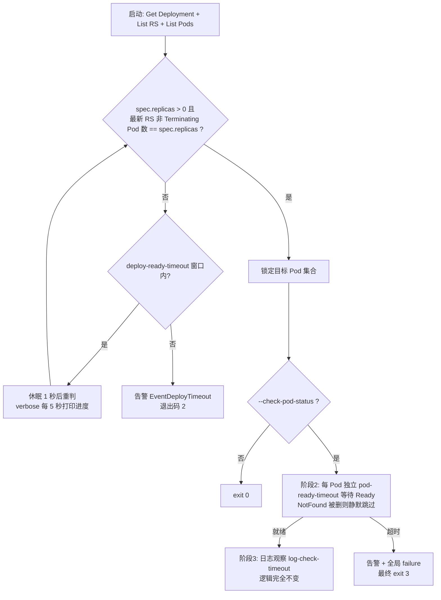

## 用户需求（原始问题与验证结论）

用户判断已验证成立：现有阶段1 要求 Deployment 完全收敛（readyReplicas == spec.replicas），而 Ready 蕴含 Running，阶段1 通过时新 Pod 必然已 Running，阶段2 的状态等待成为不可达死代码，且前置阻断导致慢启动应用丢失 Pod 早期日志。

修改诉求：阶段1 不再判断 Deployment 任何就绪条件，检测到更新后即等待新 RS 的 Pod 出现；阶段2/3 沿用现有逻辑。

## 澄清确认（用户已答复）

1. **启动时已收敛**：立即检查现存 Pod（取当前最大 revision RS 的现存 Pod 进入阶段2/3），不等待新更新事件。
2. **保留就绪探针校验能力**：阶段2 判定从 Phase == Running 升级为 Pod Ready（所有容器 Ready）。
3. **阶段1 超时**：保留退出码 2 与现有告警事件，文案更新为"未检测到更新/新 Pod"语义。

## 核心功能变化

- **阶段1（目标锁定）**：每秒轮询，当"期望副本数 > 0 且最新 revision RS 的非删除 Pod 数量达到期望副本数"即锁定目标 Pod 集合；启动时已收敛且有 Pod 则立即锁定；超时未锁定则告警并以退出码 2 退出。
- **阶段2（Pod 就绪）**：每个 Pod 独立超时等待就绪（探针通过），超时告警并计为失败（退出码 3）；Pod 被控制器删除回收时跳过该 Pod 不误报。
- **阶段3（日志观察/落盘/告警）**：完全不变。
- **收益**：新 Pod 在创建齐（尚未就绪）时即被锁定，日志观察起点显著提前；就绪探针校验能力保留；异常定位从 Deployment 级细化到 Pod 级。


## Tech Stack

沿用现有技术栈，零新增依赖：
- Go + client-go（直接 client 轮询）+ cobra 命令行
- 单测：client-go fake clientset（现有 `newFakeChecker` 模式）
- e2e：真实集群 shell 脚本（现有 13 用例体系）

## Implementation Approach

### 1. 阶段1 重构：统一锁定规则（核心决策）

新函数 `lockTargetPods` 替换 `waitDeploymentReady`（informer 收敛等待）与 `waitForTargetPods`（等 Pod 出现）。锁定条件（每秒轮询判定）：

> `*d.Spec.Replicas > 0 && 最新 revision RS（或退化 Deployment selector）的非 Terminating Pod 数 == *d.Spec.Replicas`

一条规则统一覆盖全部启动场景，**无需显式的"启动基线三分支"**：

| 启动时状态 | 行为 |
| --- | --- |
| 已收敛且有 Pod（e2e C1/C4/C5/C8~C13） | 立即锁定（澄清结论1） |
| 模板滚动中 | 新 RS selector 含 pod-template-hash，旧 Pod 天然排除；新 Pod 增长到位即锁定 |
| 纯扩容中（C3 的 0→2，无新 RS） | 新 Pod 到位即锁定 |
| 缩容中 | Pod 收缩到期望数即锁定 |
| 已收敛但 replicas=0（C3 基线） | 条件不满足持续等待，扩容后到位即锁定 |
| 窗口内无任何变化 | deploy-ready-timeout 超时 → 告警 exit 2（澄清结论3） |

**为什么轮询而非监听 generation 事件**：现有 `waitForTargetPods` 本就是 1 秒轮询，检测延迟等价；直接观测"新 RS/新 Pod 出现"这一**结果信号**，避免"事件已到但新 RS 尚未创建"时 `listTargetPods` 短暂取到旧 RS 的误锁定窗口；同时删除 informer factory/cache 同步复杂度，少一个常驻 ListWatch 连接。`-A` watcher 模式自身的 informer 不受影响，其触发的检查自动受益（触发时刚更新未收敛 → 立即盯新 RS Pod）。

### 2. 阶段2 升级：Running → Ready

`waitPodRunning` → `waitPodReady`，判定：`Phase == Running && len(ContainerStatuses) > 0 && 所有 cs.Ready`。无 readinessProbe 的容器 Running 即 Ready（kubelet 语义），busybox/nginx 类 e2e 用例行为不变。返回 `readyAt` 作为阶段3 计时锚点（`remaining = LogCheckTimeout - time.Since(readyAt)` 计算不变，日志窗口完整）。

### 3. NotFound 容错（防误报）

滚动中期锁定后，控制器可能在 maxSurge 收敛期删除个别新 Pod。`waitPodReady` 遇 `IsNotFound`：verbose 日志 + 静默结束该 goroutine（不置 failure）——应用崩溃走"未就绪超时"（CrashLoopBackOff 的 Pod 不会被删除）或阶段3 退出码路径，控制器删除 ≠ 业务故障，误报比漏检更有害。阶段3 `checkExit` 的 Get 错误已天然容忍，无需改动。

### 4. 超时窗口归属重划（语义变化需文档同步）

- `--deploy-ready-timeout`：阶段1 目标锁定窗口（吸收原 waitForTargetPods 用 pod-ready-timeout 等 Pod 出现的职责）
- `--pod-ready-timeout`：专用于阶段2 每 Pod 等待 Ready
- `--log-check-timeout`：不变

### 5. 统一文案（实现与测试断言对齐）

- 阶段1 超时告警（EventDeployTimeout + exit 2）：`Deployment %s/%s 在 %d 秒内未锁定目标 Pod（未检测到更新或新 Pod 未达到期望副本数）`，断言关键字 **"未锁定目标"**
- 阶段2 超时告警（EventPodStatus + exit 3）：`Pod %s 命名空间 %s 未就绪（超时 %d 秒）`，断言关键字 **"未就绪"**
- feishu 事件常量：`EventDeployTimeout = "Deployment目标锁定超时"`（原"Deployment就绪超时"）

### Performance

- 锁定轮询：1 秒 × 3 个只读 API 调用（Get Deployment + List RS + List Pods），与现状完全一致，无额外开销
- 锁定点从"整体收敛"（全部 Ready）提前到"新 Pod 创建齐"（可能仍 Pending），慢启动应用的日志观察窗口显著提前
- 删除阶段1 informer 后减少一个常驻 watcher goroutine 与 ListWatch 长连接

## Architecture Design

三阶段整体编排、`-A` watcher、中断处理（Interrupt/cancelAll）、飞书告警、recorder 落盘结构全部不变；仅阶段1 内部实现与阶段2 判定条件变化：



## Directory Structure

```
kubecheck/
├── internal/
│   ├── checker/
│   │   ├── checker.go            # [MODIFY] 核心重构：
│   │   │                        #   - Run(): 阶段1 调用点改为 lockTargetPods；超时分支新文案；
│   │   │                        #     删除 len(pods)==0 → "未产生任何 Pod" → exit 3 分支（被 exit 2 覆盖）；
│   │   │                        #     --check-pod-status=false 分支文案改为"目标 Pod 已锁定"
│   │   │                        #   - 新增 lockTargetPods(ctx)：1 秒轮询 + 统一锁定规则 + verbose 进度
│   │   │                        #     （timeout<=0 时立即判定一次，与旧语义对称）；Deployment
│   │   │                        #     NotFound 立即报错走 CodeParam，其他 API 错误窗口内重试
│   │   │                        #   - 删除 waitDeploymentReady / isRolloutComplete / waitForTargetPods
│   │   │                        #   - 保留 rolloutComplete（logDeploymentStatus verbose 进度用）、
│   │   │                        #     listTargetPods、rsRevision、ownerMatches
│   │   │                        #   - waitPodRunning → waitPodReady：Ready 判定 + IsNotFound 静默结束；
│   │   │                        #     trackPod 阶段2 告警文案"未就绪"，readyAt 传入 watchPodLog
│   │   └── checker_test.go       # [MODIFY] 单测重写与新增（见下）
│   ├── cmd/
│   │   └── cmd.go                # [MODIFY] Long 帮助文本三阶段描述重写；
│   │                             #   --deploy-ready-timeout 描述改为"目标锁定超时"、
│   │                             #   --pod-ready-timeout 改为"等待 Pod Ready 超时"
│   ├── options/
│   │   └── options.go            # [MODIFY] DeployReadyTimeoutSec/PodReadyTimeoutSec 注释语义更新
│   └── feishu/
│       └── feishu.go             # [MODIFY] EventDeployTimeout 常量文案改为"Deployment目标锁定超时"
├── e2e/
│   └── e2e-test.sh               # [MODIFY] C2 预期 exit 2→3 + 关键字"未就绪"；C3 关键字
│                                 #   "未进入 running"→"未就绪"；新增 C14（replicas=0 收敛
│                                 #   且不更新 → exit 2 + "未锁定目标"）；头部注释与 case 入口
│                                 #   加 c14（run-all.sh 调 ALL 自动覆盖，无需改动）
├── README.md                     # [MODIFY] 两级检查描述、特性列表、参数表（超时语义）、
│                                 #   退出码表（码 2/3 语义）、"未产生任何 Pod"路径删除说明
└── doc/
    ├── kubectl-check 插件设计规格说明书SPEC.md  # [MODIFY] 阶段1/阶段2 规格更新
    └── kubectl-check-architecture.md            # [MODIFY] 阶段1 架构描述与固有短板说明移除
```

checker_test.go 测试变更明细：
- 保留不动：`TestRolloutComplete`、`TestListTargetPodsSkipsTerminating`、`TestTrackPodContainerExitSetsFailure`、`TestWatchPodsAllReadyNoFailure`、`TestAlertFallbackConsole`
- 改写：`TestWaitDeploymentReadyImmediate/TimeoutThenAlert` → `TestLockTargetPodsImmediate/Timeout`（fake: Deployment+RS+Ready Pod 立即锁定 / 无 Pod 超时 ~1s 返回 false）；`TestRunNoPods` → 收敛且无 Pod 断言 exit 2 + "未锁定目标"（原 exit 3）；`TestRunDeployTimeout` 文案断言改"未锁定目标"；`TestTrackPodReadyTimeoutSetsFailure` 断言改"未就绪"
- 新增：`TestPodReady`（Running+Ready / Running+NotReady / Pending / 无容器状态四分支）；`TestLockTargetPodsWaitsForPods`（goroutine 延迟创建 Pod 后锁定成功）；`TestWaitPodReadyPodDeleted`（Pod 被 NotFound 删除 → 静默返回且不置 failure）

## Key Code Structures

```go
// lockTargetPods 阶段1（新语义）：在 deploy-ready-timeout 窗口内每秒轮询，
// 直到锁定条件满足：spec.replicas > 0 且最新 revision RS 的非 Terminating
// Pod 数量 == spec.replicas。超时返回 (nil, false)；Deployment 不存在返回错误。
func (c *Checker) lockTargetPods(ctx context.Context) (pods []corev1.Pod, err error)

// podReady 阶段2 判定：Phase == Running 且所有容器 Ready（无探针容器 Running 即 Ready）
func podReady(p *corev1.Pod) bool

// waitPodReady 阶段2：pod-ready-timeout 内轮询等待 Pod 就绪，返回就绪时刻
// （阶段3 日志观察计时锚点）；Pod 被删除（IsNotFound）时静默结束不置 failure。
func (c *Checker) waitPodReady(ctx context.Context, pod corev1.Pod) (readyAt time.Time, ok bool)
```

