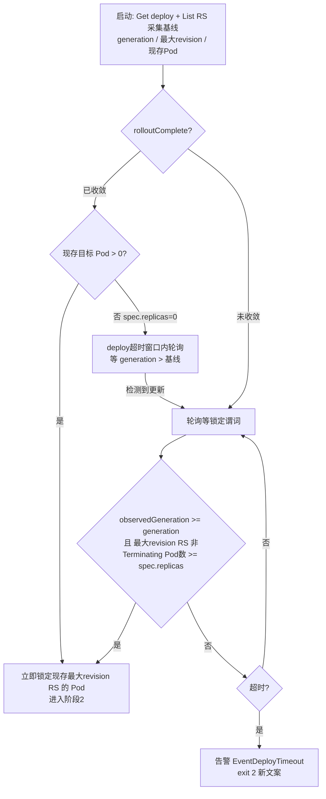

## 产品概览
kubectl-check 是部署后自动化校验的 kubectl 插件，按三阶段检查 Deployment 发布。本次修改**阶段1**的触发逻辑并升级**阶段2**的判定条件，阶段3（日志观察/落盘/告警）完全不变。

## 问题确认
原阶段1 等待 Deployment 滚动收敛（所有新副本 Ready），而 Ready 包含 Running，故阶段1 通过后新 Pod 必然已 Running，阶段2"等 Pod 进入 Running"是无意义的死代码；且阶段1 前置阻断导致慢启动应用丢失 Pod 早期日志。用户判断正确，按新逻辑重构。

## 核心功能（修改后）
- **阶段1（目标锁定，替代原"滚动收敛等待"）**：启动时采集基线（当前 generation、最大 revision ReplicaSet、现存 Pod 名单），三分支处理：
  - 启动时滚动未完成 → 视为更新进行中，等待新 RS 的 Pod 名单齐备（数量达到期望副本数，Pending/拉镜像中即计入）
  - 启动时已收敛且存在 Pod → 立即以现存最新 RS 的 Pod 为检查目标
  - 启动时已收敛且无 Pod → 在超时窗口内等待更新发生（含扩缩容），再等新 Pod 出现
  - 超时未锁定目标 → 告警并退出（**退出码 2 保留**），文案改为"超时内未检测到更新/新 Pod"；原"未产生任何 Pod"路径并入此超时语义
- **阶段2**：判定条件从"Pod 进入 Running"升级为"Pod 就绪（Ready，含就绪探针校验）"，弥补原阶段1 隐含的探针校验能力；超时未就绪仍告警并异常退出（退出码 3）
- **阶段3**：逻辑不变；因目标锁定大幅提前，日志观察起点更接近容器真实启动时刻，慢启动应用早期日志不再丢失
- **保留**：中断退出（130）、飞书告警降级、退出码 2/3 语义、-A 全命名空间监听模式（复用检查主流程，自动受益，无需改动）

## 边界与影响
- 无就绪探针的容器 Running 即 Ready，现有正常场景行为不变
- 原阶段1 超时场景（探针永远失败）现在由阶段2 就绪超时捕获：退出码从 2 变为 3，属预期语义变化，需同步用例与文档


## 技术栈
- 全部复用现有栈：Go + client-go + cobra；测试用 client-go fake clientset（现有模式）+ e2e bash 脚本
- **不新增依赖**：Pod Ready 判定在本地实现（等价 `podutil.IsPodReady` 语义），不引入 `k8s.io/kubectl`

## 实现方案

### 总体策略
将阶段1 从"等待 Deployment 收敛（rolloutComplete 阻断）"重构为"**目标锁定**"：以启动基线三分支 + 1 秒轮询的锁定谓词，尽早锁定本次发布的新 RS Pod 名单，随后阶段2/3 接管。删除 informer 收敛等待（`waitDeploymentReady`），改用与现有 `waitForTargetPods`/`waitPodRunning` 一致的轮询模式——复合条件（generation/observedGeneration/RS revision/Pod 数量）轮询远比 informer 事件组合简单、可测。

### 阶段1：lockTargetPods 三分支判定（替换 waitDeploymentReady + waitForTargetPods）

关键点（已验证现有代码行为）：
- **误锁定防护**：谓词含 `observedGeneration >= generation`——controller 观察到最新 spec 时新 RS 必已创建，避免更新瞬间取到旧 RS；`spec.replicas` 每 tick 重读，覆盖 scale 场景（e2e C3：scale 递增 generation、不建新 RS）
- **滚动中二次更新**：谓词每 tick 重读最新值，自动跟随
- **超时归属**：`--deploy-ready-timeout` = 阶段1 目标锁定整体窗口（`<=0` 沿用"立即单次判定"原则）；`--pod-ready-timeout` 专用于阶段2 等 Ready
- **中断**：等待 ctx 经 `registerCancel` 登记，SIGINT 立即退出（沿用现有模式）
- 保留 `rolloutComplete`/`isRolloutComplete`/`logDeploymentStatus` 用于启动收敛判定与 verbose 进度日志；`TestRolloutComplete` 继续有效

### 阶段2：waitPodRunning → waitPodReady
- 判定改为 PodReady condition == True（本地 `podReady` helper，等价 podutil.IsPodReady）；无探针容器 Running 即 Ready，busybox/nginx 用例行为不变
- **阶段3 锚点不变**：轮询中首次观察到 `Phase == Running` 的时刻记为 `runningAt`（首次已 Ready 则取当前时刻）返回，`watchPodLog(ctx, pod, runningAt)` 签名与"从 Running 时刻计时"语义不动；recorder 的 `waitForContainerRunning` + `--log-tail` 回溯兜底早期日志
- 超时告警文案："未进入 running（超时 N 秒）" → "未就绪（Ready 超时 N 秒）"，仍置 `hasPodFailure` → exit 3

### Run 编排调整（checker.go:95-156）
- 阶段1 调用改为 `lockTargetPods`；Get/List 失败 → CodeParam（沿用）；未锁定 → `alert(EventDeployTimeout, ...)` 新文案 → exit 2
- `--check-pod-status=false` 分支移至目标锁定之后（"目标锁定完成（未启用 Pod 追踪）"→ exit 0）
- 删除原 `waitForTargetPods` 空名单告警路径（并入 exit 2）；`CodePodNotReady` 仍用于阶段2/3

### 性能与回归控制
- 轮询 1s ×（Get deployment + List RS + List pods），单目标规模开销可忽略，与现有轮询模式一致；顺带删除原 informer 每 2s 的状态 Get（仅 verbose 保留）
- 不新增 goroutine/依赖；阶段3、中断链路（Interrupt/cancelAll）、飞书告警、-A watcher（watcher.go）零改动，watcher 触发的检查自动走新阶段1（触发时未收敛 → 立即盯新 RS Pod，比旧逻辑更早）
- 回归面：e2e C2 预期从 exit 2 变 exit 3（语义变化需文档明示）；C1/C4/C5/C8~C13 行为不变

## 目录结构
```
kubecheck/
├── internal/checker/checker.go        # [MODIFY] 核心：Run 编排、lockTargetPods 三分支（替换 waitDeploymentReady/waitForTargetPods）、
│                                      #   listTargetPods 拆出 newestReplicaSet、waitPodReady + podReady helper、告警文案
├── internal/checker/checker_test.go   # [MODIFY] 既有用例断言更新（TestRunDeployTimeout/TestRunNoPods/TestTrackPodReadyTimeoutSetsFailure）、
│                                      #   makeReadyPod 补 PodReady condition、新增 lockTargetPods 三分支用例；TestRolloutComplete 保留
├── internal/cmd/cmd.go                # [MODIFY] Long 帮助文本（27-44 行三阶段描述）与 --deploy-ready-timeout/--pod-ready-timeout flag 描述
├── internal/options/options.go        # [MODIFY] DeployReadyTimeoutSec/PodReadyTimeoutSec 注释语义更新
├── README.md                          # [MODIFY] 两级检查描述、特性、参数表（77-79 行）、退出码表（102 行）
├── doc/                               # [MODIFY] SPEC/架构文档中阶段1/2 描述同步（次要）
└── e2e/e2e-test.sh                    # [MODIFY] C2 预期改 exit 3、C3 断言关键字改"未就绪"、核对 C7 关键字
```

## 关键代码结构
```go
// lockTargetPods 阶段1（目标锁定）：三分支判定 + deploy-ready-timeout 窗口内 1s 轮询。
// 返回锁定的目标 Pod 名单；err 非 nil 表示资源访问失败（CodeParam）；
// 超时未锁定返回 (nil, nil)，由 Run 告警 EventDeployTimeout 并 exit 2。
func (c *Checker) lockTargetPods(ctx context.Context) ([]corev1.Pod, error)

// podReady Pod 就绪判定（等价 podutil.IsPodReady，不引入 k8s.io/kubectl）：
// Status.Conditions 中 Type == corev1.PodReady 且 Status == corev1.ConditionTrue
func podReady(p *corev1.Pod) bool

// waitPodReady 阶段2：轮询等待 Pod Ready；
// 返回 (runningAt, ok)，runningAt = 首次观察到 Phase == Running 的时刻（阶段3 日志观察锚点）
func (c *Checker) waitPodReady(ctx context.Context, pod corev1.Pod) (time.Time, bool)
```

