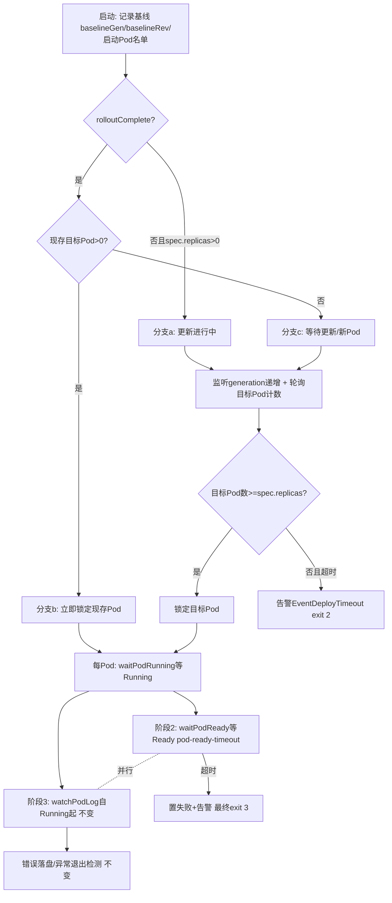

## 用户需求
- **评估判断（已确认成立）**：现有阶段1 以 Deployment 就绪收敛（全部副本 Ready）作为前置阻断，通过时 Pod 必然已运行，阶段2 再校验“运行中”属于无效重复校验（其超时告警分支为不可达代码），且前置阻断导致慢启动应用丢失 Pod 早期日志。
- **修改逻辑**：阶段1 不再判断 Deployment 任何就绪条件，改为“监听到 Deployment 发生更新 → 等待对应新 RS 的 Pod 出现”，随后进入阶段2/3。

## 澄清结论（用户已确认）
1. **启动时滚动已完成**：立即检查现存 Pod，不等待新更新事件（与现有“发布完成后启动工具”的使用方式兼容）。
2. **保留就绪探针校验能力**：阶段2 判定条件从“运行中”升级为“就绪”。
3. **阶段1 超时**：沿用退出码 2 与既有告警事件，文案更新为“超时内未检测到更新/目标 Pod 未齐备”类语义。

## 产品概述
kubecheck（kubectl-check）是部署后自动化校验插件：分两级独立检查（Deployment 层 / Pod 状态+日志层）+ 告警 + 错误日志落盘。本次重构第一级的触发语义（从“等收敛”变为“检测更新即锁定目标”），第二级能力保持并增强。

## 核心功能
- **阶段1（重构为“更新检测 + 目标锁定”）**：
  - 启动基线三分支：更新进行中 → 锁定新 RS 目标 Pod；已完成且有现存 Pod → 立即检查现存 Pod；已完成且无 Pod → 在超时窗口内等待更新或新 Pod 出现
  - 更新判定：spec 变更（generation 递增，含 rollout restart / scale）即触发，纯状态上报不触发
  - 锁定完成条件：新目标非删除中 Pod 数量达到期望副本数（Pending 也计入，尽早锁定、尽早开始盯日志）
  - 超时未锁定 → 告警并退出（码 2）
- **阶段2（升级）**：每个 Pod 独立超时等待就绪条件（含就绪探针校验），超时 → 告警并计 Pod 失败（最终码 3）
- **阶段3（不变）**：从 Pod 运行时刻起独立观察日志、错误落盘、容器异常退出/重启超限检测；与阶段2 并行执行
- **兼容性**：启动时已完成的发布立即检查现存 Pod，现有使用方式与多数现有用例行为保持不变


## 技术栈（沿用现有，零新增依赖）
- Go + cobra + client-go（informer 事件驱动 + 轮询兜底），版本见 go.mod

## 实现方案

### 1. 阶段1 重构：`waitDeploymentReady`/`waitForTargetPods` → `lockTargetPods`（checker.go）

**启动基线**（一次 Get Deployment + List RS + List Pod）：
- `baselineGen`：当前 generation；`baselineRev`：Deployment 控制的 RS 中最大 revision；`startupPodNames`：Deployment 控制的全部非 Terminating Pod 名集合
- Deployment 不存在 → 返回错误，`Run` 走 `CodeParam`(1)（与 README 退出码 1 “目标资源不存在”对齐，替代现在的“干等到超时 exit 2”）

**分支判定**：
- **分支 a（!rolloutComplete 且 spec.replicas>0，更新进行中或稳定但不健康）**：进入锁定等待
- **分支 b（rolloutComplete 且现存目标 Pod>0）**：立即返回现存最大 revision RS 的 Pod（q1 答案，兼容 e2e C1/C4/C5/C8~C13）
- **分支 c（rolloutComplete 且无 Pod，含 replicas=0）**：进入锁定等待，等更新事件或新 Pod 出现

**锁定等待循环**（复用 `waitDeploymentReady` 的 informer 骨架：factory / UpdateFunc / notifyCh / `WaitForCacheSync` / 超时上下文；`deploy-ready-timeout<=0` 时仅做一次即时判定）：
- 事件驱动：UpdateFunc 条件从 `rolloutComplete(d)` 改为 `d.Generation > baselineGen`（参考 `watcher.go:70` 现成实现，纯 status 变化不触发）；命中后刷新 `baselineGen`
- 轮询兜底（1s，namespace 级 List RS + List Pod，与现有 `waitForTargetPods` 同量级）：计算目标 Pod 并判断计数

**目标 Pod 统一判定**（Deployment 控制且非 Terminating，满足其一）：
1. 所属 RS revision > baselineRev（更新后创建的新 RS 的 Pod，解决“更新事件先于新 RS 创建”的误锁定窗口）
2. Pod 名不在 `startupPodNames`（覆盖 scale 扩容——不产生新 RS，及滚动中被重建的同 RS 新 Pod）
3. 启动种子：`observedGeneration >= generation` 且未收敛时，最大 revision RS 的现存 Pod 直接计入（覆盖“滚动已进行、新 RS 已创建”与“稳定但从不收敛（如探针失败）”两类启动场景）

**完成条件**：目标 Pod 数 ≥ 当前 spec.replicas（Pending 即计入，远早于旧收敛点）；实现时可加一次计数稳定确认（连续两轮计数一致）规避 maxSurge 瞬态多出的 Pod 被漏盯。中途 scale 到 0 导致目标为空 → 沿用 `Run` 现有“未产生任何 Pod”告警 + exit 3 防御分支。

**超时**：`deploy-ready-timeout` 窗口内未锁定 → `feishu.EventDeployTimeout` 告警（新文案：“N 秒内未检测到 Deployment 更新或目标 Pod 未达到期望副本数”）+ `CodeDeployTimeout`(2)。`rolloutComplete` 保留（分支判定 + verbose 进度日志），`isRolloutComplete` 并入。

### 2. 阶段2 升级为 Ready + 与阶段3 并行（`trackPod` 重构）

- 新增 `waitPodReady`：在 `pod-ready-timeout` 剩余窗口内轮询，判定 `Conditions` 中 `type=Ready && status=True`（等价 `kubectl wait --for=condition=ready`，纯 client-go 实现，不引新依赖）；超时 → `setPodFailure` + `EventPodStatus` 告警；检测到容器 Terminated（exit≠0）或 Pod 终态时提前返回（避免与阶段3 重复等待）
- **关键设计**：`waitPodRunning`（等 Running）保留且逻辑不变；观测到 Running 后 **fork 两个并行 goroutine**（均登记 `wg`）：阶段2 `waitPodReady`（共用同一个 per-pod `readyCtx`，即一个 pod-ready-timeout 覆盖 创建→Running→Ready）+ 阶段3 `watchPodLog(ctx, pod, runningAt)`
- **理由**：`watchPodLog` 函数体与“从 Running 时刻计时”语义完全不动（严格满足“阶段3 无需改动”）；若改成等 Ready 后再观察日志，反而改变了阶段3 的计时起点并重新引入“Running→Ready 窗口日志丢失”，与本次重构动机相悖；并行结构同时对齐 README 已文档化的“Pod 状态与日志跟踪并行”描述
- 容器先异常退出后 Ready 永不满足的场景：阶段3 的 exit 检测即时告警，阶段2 提前返回，飞书去重窗口兜底同类告警
- 收益：`--log-enable=false` 时阶段2 仍能通过 Ready 超时发现 crash-loop 类异常（旧逻辑此场景漏检）

### 架构流程



## 实现要点（防回归）
- **复用既有模式**：informer 骨架与 notifyCh 非阻塞通知（`waitDeploymentReady` 181-226 行）、`rsRevision`/`ownerMatches`/Terminating 过滤（`listTargetPods`）、`registerCancel`（新锁定的超时 cancel 应登记，中断时统一取消）、`logf` verbose 轨迹（更新措辞为“阶段1: 检测更新/等待目标 Pod”）
- **性能**：Deployment 更新走事件驱动不空转；目标计数轮询 1s、namespace 级 List，与现有 `waitForTargetPods` 完全同量级；无新增依赖、无额外常驻 goroutine
- **爆炸半径控制**：`watcher`（-A 模式）零改动且自动受益（触发时更新刚发生 → 走分支 a 立即盯新 RS Pod，比旧的等收敛更早）；阶段3、中断处理、飞书告警、落盘逻辑不动；e2e C1/C4/C5/C6/C8~C13 预期行为不变
- **行为变化点（需文档同步）**：C2 类“探针永远失败”场景从 exit 2 变为 exit 3；exit 2 语义变为“超时未检测到更新/目标未锁定”；`--deploy-ready-timeout` 语义变为“目标锁定窗口”（默认 300s 不变，`pod-ready-timeout` 专用于阶段2 等 Ready）

## 目录结构
```
kubecheck/
├── internal/checker/
│   ├── checker.go              # [MODIFY] 核心：Run 阶段1调用点与告警文案；waitDeploymentReady+waitForTargetPods 合并重构为 lockTargetPods（基线/三分支/目标判定/计数等待）；新增 waitPodReady 与 podReady；trackPod 重构为 Running 后并行 fork 阶段2/3；rolloutComplete 保留用于分支判定；watchPodLog 及其余全部不动
│   ├── checker_test.go         # [MODIFY] rolloutComplete 用例保留并补充分支语义；新增 podReady 条件判定、目标 Pod 过滤规则（rev>基线 / 名单外 / 启动种子）、计数完成与超时用例
│   └── integration_test.go     # [MODIFY] 适配阶段1 新语义：fake 驱动的分支a/b/c、更新事件触发、scale 场景目标锁定、阶段2 Ready 超时用例
├── internal/cmd/
│   └── cmd.go                  # [MODIFY] Long 帮助文本（27-44 行三阶段描述重写）、--deploy-ready-timeout/--pod-ready-timeout flag 描述更新
├── internal/options/
│   └── options.go              # [MODIFY] DeployReadyTimeoutSec/PodReadyTimeoutSec 注释语义更新（锁定窗口 / Ready 等待）
├── e2e/
│   └── e2e-test.sh             # [MODIFY] C2 改写（探针失败→阶段2 Ready 超时→exit 3）；新增 exit 2 新语义用例（replicas=0 且不触发更新→超时告警）；核对 C3（仍 exit 3）/C7（watcher 日志关键字）
├── README.md                   # [MODIFY] 两级检查描述、特性、参数表、退出码表同步新语义
└── doc/                        # [MODIFY] SPEC/架构文档中阶段1/2 描述与流程图同步更新
```

## 关键代码结构
```go
// lockTargetPods 阶段1（重构后）：目标锁定，替代 waitDeploymentReady + waitForTargetPods
// err 非 nil：Deployment 不存在等前置错误（exit 1）；ok=false：锁定超时（exit 2）
func (c *Checker) lockTargetPods(ctx context.Context) (pods []corev1.Pod, ok bool, err error)

// isTargetPod 目标 Pod 统一判定（Deployment 控制且非 Terminating，满足其一）：
//   1) 所属 RS revision > baselineRev（新 RS）
//   2) Pod 名不在启动基线名单（scale 扩容 / 同 RS 重建）
//   3) 启动种子：obs>=gen 且未收敛时最大 revision RS 的现存 Pod
func (c *Checker) isTargetPod(p *corev1.Pod, baselineRev int64, baselinePods map[string]bool) bool

// waitPodReady 阶段2（升级）：pod-ready-timeout 剩余窗口内等待 Ready；终态/容器退出提前返回
func (c *Checker) waitPodReady(ctx context.Context, pod corev1.Pod) bool

// podReady 判定 Conditions 中 type=Ready 且 status=True（等价 kubectl wait --for=condition=ready）
func podReady(p *corev1.Pod) bool
```

