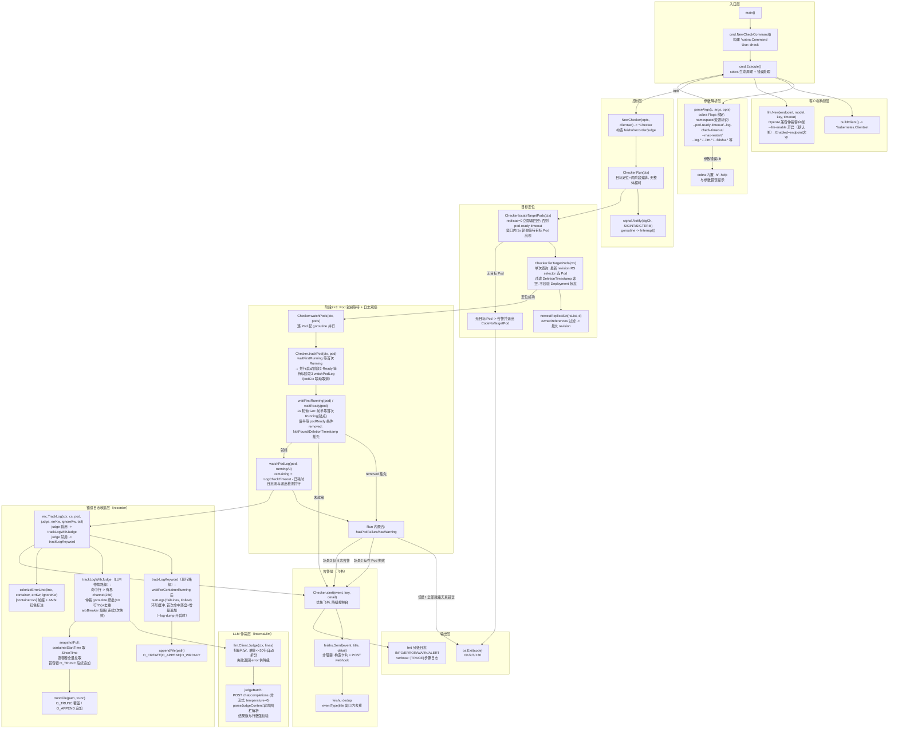
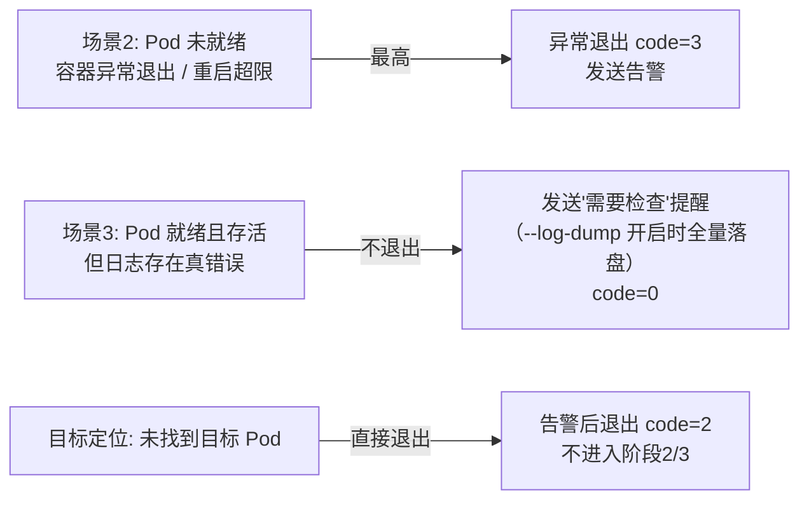

# kubectl-check 插件架构设计（规划图表）

> 本文档基于 `kubectl-check 插件设计规格说明书SPEC.md` 生成，用于流程图与函数/方法调用关系拓扑图审阅（对照当前代码）。
> 技术栈：client-go + cobra。目标定位为 **1s 轻量轮询等待目标 Pod 出现**（不校验 Deployment 超时与滚动状态），阶段2 就绪等待 / 阶段3 退出检测同样 **1s 轻量轮询**，日志采用 **Follow 流式长连接 + LLM 异步仲裁**（OpenAI 兼容协议，默认端点智谱 GLM；`--llm-enable`/`--keyword-check` 默认关闭）。
>
> **目标定位 + 两阶段独立检查（无整体超时）**：
> 1. 两段**独立**超时：`--pod-ready-timeout`（目标定位等待 + Pod 就绪）/ `--log-check-timeout`（日志观察）；
> 2. **目标定位**：`locateTargetPods` 在 `--pod-ready-timeout` 窗口内等待最新 revision RS 的目标 Pod 出现（覆盖"发布刚触发、新 RS 已创建但 Pod 尚未创建"的竞态窗口）；`replicas=0` 或窗口内未出现则**告警后直接退出**（退出码 2）；
> 3. **阶段2**：`waitFirstRunning` 等待 Pod 进入 Running → 立即启动 `watchPodLog` 日志观察（日志流 + LLM 仲裁 + 退出检测并行，超时独立），同时 `waitReady` 继续等待 PodReady（探针校验）——**阶段2/3 并行**（有探针时 0/1 Running 期间共同作用，任一终态经 podCtx 联动取消另一路）；
> 4. **优先级 Pod 异常 > 日志告警**：
>    - 场景1：Pod 就绪且无真错误日志 → 退出码 0；
>    - 场景2：Pod 未就绪 / 容器异常退出 / 重启超限 → 告警 + 异常退出（码 3）；
>    - 场景3：Pod 就绪但日志存在真错误（Pod 存活）→ 日志窗口结束发送「需要检查」提醒（码 0，不退出；`--log-dump` 开启时全量落盘）。

---

## 1. 整体执行流程图（Mermaid flowchart）

依据当前实现：参数初始化与校验（cobra）→ 构建客户端 → **目标定位（等待目标 Pod 出现）** → 未找到目标 Pod 则告警并直接退出 → **阶段2+3：逐 Pod「waitFirstRunning 等首次 Running → 并行（waitReady 就绪等待 + watchPodLog 日志观察，LLM 仲裁 + 退出检测）」** → 按优先级聚合场景（1/2/3）→ 结果输出与退出。无整体超时、无稳定窗口。

```mermaid
flowchart TD
    Start([kubectl check 调用<br/>cobra: cmd.Execute]) --> ParseArgs[解析参数 / 校验合法性<br/>cobra Flags 绑定 + RunE]
    ParseArgs -->|参数非法| Exit1[返回错误并退出 code=1]
    ParseArgs -->|参数合法| BuildClient[构建 K8s 客户端 + LLM 仲裁客户端<br/>llm.New: --llm-enable 开启, 默认端点智谱 GLM]

    BuildClient --> Locate[目标定位: locateTargetPods<br/>1s 轮询等待最新 revision RS 的目标 Pod 出现<br/>pod-ready-timeout 窗口, 不校验 Deployment 状态]
    Locate -->|replicas=0 无目标可等<br/>或窗口内未出现| AlertNoPod[发送告警 EventNoTargetPod<br/>未找到目标 Pod]
    AlertNoPod --> NoPodExit[退出: CodeNoTargetPod=2]
    Locate -->|目标 Pod 出现<br/>Pending 即算定位成功| CheckStatus{--check-pod-status?}
    CheckStatus -->|false| Result0c[Result(code=0)<br/>目标定位完成, 未启用 Pod 追踪]
    CheckStatus -->|true| Parallel[阶段2+3: 逐 Pod goroutine<br/>watchPods]

    Parallel --> PodWatch[阶段2: Pod 就绪轮询<br/>waitFirstRunning→waitReady: 1s Get<br/>--pod-ready-timeout]
    PodWatch --> PodReady{在超时内就绪?}
    PodReady -->|Pod 被 controller 删除<br/>NotFound / DeletionTimestamp| Skip[静默跳过<br/>surge 缩容/回滚, 非异常]
    PodReady -->|否| Scenario2[场景2: Pod 未就绪<br/>alert EventPodStatus<br/>（取消阶段3, 仅此一条告警）]
    Scenario2 --> AlertPod[发送告警: Pod 未就绪] --> Result3[Result(code=3)]

    PodReady -->|是| ReadyOK[阶段2 结束<br/>阶段3 继续至日志窗口结束]

    PodWatch -->|首次 Running（锚点）<br/>podCtx 联动取消| LogStream[阶段3: watchPodLog<br/>与阶段2 Ready 等待并行<br/>（0/1 Running 期间共同作用）<br/>日志观察两路并行<br/>计时起点 = 首次观察到 Running]
    LogStream --> LT[日志流: rec.TrackLog<br/>Follow 实时跟踪]
    LT --> LLMMode{LLM 启用?}
    LLMMode -->|是 默认| Arb[命中行投入 pod 级有界 channel<br/>仲裁 goroutine: 攒批10行/2s + 去重<br/>→ llm.Judge 批量判定]
    Arb -->|任一真错误| Snap[SinceTime 容器启动时刻全量拉取<br/>O_TRUNC 覆盖写快照 + errorHit]
    Arb -->|全部假错误| NoFile[不落盘不告警]
    Arb -->|调用失败| Degrade[降级: 关键字即真<br/>连续3次失败熔断不再重试]
    LLMMode -->|否 显式置空| Kw[现行逻辑: 环形缓冲<br/>首次命中落盘 + 增量追加<br/>（--log-dump 开启时）]
    LogStream --> EX[退出检测: 1s ticker<br/>containerExitCode / totalRestartCount<br/>删除中 Pod 豁免]
    EX -->|容器退出 exit!=0<br/>（含 Ready 前崩溃, 取消阶段2）| AlertExit[alert EventContainerExit<br/>+ waitLogFlush 落盘<br/>（--log-dump 开启时）] --> Result3
    EX -->|重启超限| AlertRestart[alert EventRestartLimit] --> Result3
    Snap --> LogHit{errorHit?}
    Degrade --> LogHit
    Kw --> LogHit
    LogHit -->|是| Scenario3Mark[场景3: 标记日志告警<br/>窗口结束 alert EventPendingCheck<br/>「需要检查」非阻塞]
    LogHit -->|否| Scenario1Chk{Aggregate 聚合<br/>watchPods goroutine 全部结束}
    Scenario3Mark --> Scenario1Chk

    Scenario1Chk -->|存在 Pod 失败| Result3
    Scenario1Chk -->|仅日志告警| Result0b[Result(code=0)<br/>已发 EventPendingCheck]
    Scenario1Chk -->|全部正常| Result0[Result(code=0)]

    Result0 --> Cleanup[关闭日志流 / 释放缓存]
    Result0b --> Cleanup
    Result0c --> Cleanup
    Result3 --> Cleanup
    Exit1 --> Cleanup
    Cleanup --> End([进程退出])
```

> 图中 `Result(code=?)` 为统一结果输出节点；场景3 的「需要检查提醒」在日志观察窗口结束后触发，属**非阻塞**动作，不影响退出码（返回 0）。

**异常终止优先级**：
- **Pod 异常（场景2：未就绪 / 容器异常退出 / 重启超限）> 日志告警（场景3）**：任一 Pod 失败即最终退出码 3；
- 场景3（Pod 已就绪但存在真错误日志且存活）**不终止流程**，仅补发提醒（`--log-dump` 开启时全量落盘），返回 0；
- 未找到目标 Pod（目标定位）**直接终止流程**，告警并以退出码 2 退出，不再追踪 Pod。

---

## 2. 函数 / 方法调用关系拓扑图（Mermaid）

以 `main` 为根，标注各函数职责与 client-go 调用点。分层：入口层（cobra） / 参数解析层 / 客户端构建层 / 控制层 / 校验层 / 日志层 / **错误日志收集层（关键字路径 + LLM 仲裁路径）** / **LLM 仲裁层** / **告警层（飞书）** / 输出层。



**关键 client-go / 三方调用点汇总**
- 命令行：`github.com/spf13/cobra`（`NewCheckCommand` / `cmd.Flags()` / `RunE`）
- 客户端：`clientcmd.NewDefaultClientConfigLoadingRules` + `clientcmd.NewNonInteractiveDeferredLoadingClientConfig` / `kubernetes.NewForConfig`
- 目标定位：`clientset.AppsV1().Deployments().Get`（取 Deployment，判 replicas 与目标存在性）+ `clientset.AppsV1().ReplicaSets().List`（最大 revision new_rs）+ `clientset.CoreV1().Pods().List`（new_rs selector，过滤 DeletionTimestamp 非空；无法判定最新 RS 时退化为 deployment selector 兜底）——1s 轮询等待目标 Pod 出现，不校验 Deployment 滚动状态
- Pod 状态轮询：`clientset.CoreV1().Pods(ns).Get(ctx, name, ...)`（1s ticker；就绪判定 `podReady` = PodReady 条件 True；退出检测判断容器 `State.Terminated` 与 `RestartCount`；删除中 Pod 豁免）
- 日志流：`clientset.CoreV1().Pods(ns).GetLogs(name, &PodLogOptions{Container, TailLines, Timestamps, Follow}).Stream(ctx)`（容器已退出时降级非 Follow + 独立短超时 ctx 拉历史日志）
- 全量快照（LLM 路径）：`GetLogs(name, &PodLogOptions{Container, Timestamps, SinceTime: 容器启动时刻}).Stream(ctx)`，首容器 O_TRUNC 后续容器追加
- LLM 仲裁：标准库 `net/http` POST OpenAI 兼容 chat completions（默认 `https://open.bigmodel.cn/api/paas/v4/chat/completions`，model `GLM-4-Flash-250414`）；非流式、temperature=0、批量 system prompt；响应解析容忍 ```json 围栏
- 错误日志落盘：标准库 `os.OpenFile`（O_TRUNC 覆盖写快照 / O_APPEND 增量追加）；未发现真错误且未报错退出不产生文件
- 颜色标注：ANSI 转义码（红色 `\x1b[31m` / 复位 `\x1b[0m`）
- 飞书告警：`net/http` POST webhook + `crypto/hmac`（`--feishu-secret` 签名校验模式）

---

## 3. 异常终止优先级与退出码映射

### 3.1 异常终止优先级

无整体超时、无稳定窗口。优先级按「Pod 异常 > 日志告警」聚合判定：



- **Pod 异常（场景2）优先级最高**：只要存在一个 Pod 未就绪、容器异常退出或重启超限，即按场景2 处理（告警 + 异常退出 code=3）；即便同时有真错误日志，因「Pod 异常 > 日志告警」也按场景2；
- **场景3（Pod 已就绪且存活但存在真错误日志）不终止流程**：窗口结束后发送「需要检查」提醒，返回 code=0（`--log-dump` 开启时 SinceTime 全量日志已落盘）；
- **未找到目标 Pod（目标定位）直接终止流程**：告警后以退出码 2 退出，不进入阶段2/3。

### 3.2 退出码映射

| 退出码 | 含义 | 触发条件 |
| --- | --- | --- |
| 0 | 正常 | 场景1（Pod 就绪且无真错误日志）或场景3（Pod 就绪且存活但存在真错误日志，已提醒；`--log-dump` 开启时已落盘）；`--check-pod-status=false` 时目标定位完成即 0 |
| 1 | 参数/环境错误 | 参数非法、K8s 客户端构建失败、目标查询失败（cobra RunE 返回错误） |
| 2 | 未找到目标 Pod | 目标定位未找到目标 Pod（`replicas=0` 无目标可等，或 `--pod-ready-timeout` 窗口内目标 Pod 未出现）；**告警后直接退出，不进入阶段2/3**（目标 Deployment 不存在由 cobra RunE 返回错误，code=1） |
| 3 | 场景2：Pod 异常 | Pod 在 `--pod-ready-timeout` 内未就绪（Ready 超时）/ 容器异常退出（exit code != 0）/ 重启超 `--max-restart`；异常退出 |
| 130 | 收到中断信号主动退出 | SIGINT/SIGTERM 触发 `Interrupt()`：取消上下文 → 等待收尾 → 发送 `EventInterrupted` 告警后退出，**不误报为业务错误** |

> 说明：
> - 两段超时常量独立：`--pod-ready-timeout` / `--log-check-timeout`，彼此互不影响，无顶层兜底超时；目标定位复用 `--pod-ready-timeout` 作为等待窗口（与阶段2 各自独立计时）；
> - 场景3「需要检查」提醒为**非阻塞通知**，在日志观察窗口结束后发送，**不改变最终退出码**（code=0）。

---

## 4. 错误日志落盘设计（`--log-dump`，默认关闭）

> **默认关闭**（`--log-dump=false`）：日志检测、LLM 仲裁、告警与退出码均不受影响，仅不产生日志文件、告警不附带落盘路径；开启后按本章规则写文件。

### 4.1 文件命名与位置

- 文件名：`{namespace}-{podName}-{date}.log`（如 `delta-test-app-76b5f8d5c9-abc12-20260815.log`），date 格式 `20060102`，跨天自动切换新文件；
- 存放目录：`--log-error-dir` 指定（默认当前工作目录 `.`），目录不存在自动创建。

### 4.2 记录内容（按 LLM 启用与否两条路径）

**LLM 启用（默认）——SinceTime 全量快照覆盖写**：

- 仲裁确认真错误后，以容器启动时间为起点（`State.Running.StartedAt`；已退出取 `LastTerminationState.Terminated.StartedAt`；均不可得回退 Pod 创建时间，多容器取最早）逐容器**全量拉取**从启动到当前的日志；
- 首个可拉取容器 `O_TRUNC` 覆盖旧快照，后续容器追加；同 Pod 后续新真错误重新覆盖，快照始终为最新最全；
- 容器异常退出（exit code != 0）未经仲裁命中真错误时，同样全量快照保留现场（不经 LLM、不计 errorHit）。

**LLM 禁用（`--llm-enable=false` 或 `--llm-endpoint=""`）——现行关键字路径**：

- `GetLogs(&PodLogOptions{Container, TailLines: --log-tail, Timestamps: true, Follow: true})` 开启流式读取，`--log-tail`（默认 100）回溯容器近期日志；
- 未命中错误前**内存缓冲**（环形缓冲，容量随 --log-tail 放大），首次命中错误时把缓冲日志一次性落盘（`O_CREATE|O_APPEND|O_WRONLY`），此后逐行增量追加（同日同 Pod 追加同一文件）。

**两条路径共同点**：

- 命中 `--log-err-keywords` 的行用 ANSI 转义码 `\x1b[31m`（红色）包裹、行尾 `\x1b[0m` 复位；忽略关键字命中的行不标红；每行带 `[时间戳] [container=xxx]` 前缀；
- 正常应用（未发现真错误、容器未报错退出）**不产生日志文件**。

```
[2026-08-15T10:00:00+08:00] [container=app] INFO starting server :8080
[2026-08-15T10:00:02+08:00] [container=app] INFO heartbeat ok
[2026-08-15T10:00:03+08:00] [container=app] \x1b[31mlevel=ERROR msg="connection refused" err="dial tcp ..." (red line)\x1b[0m
[2026-08-15T10:00:04+08:00] [container=app] \x1b[31mpanic: nil pointer dereference (red line)\x1b[0m
```

### 4.3 LLM 仲裁机制（trackLogWithJudge）

- 命中行投入 pod 级有界 channel（容量 256，满则丢弃并计数，绝不阻塞日志流）；
- 仲裁 goroutine：攒批（10 行 / 2 秒）+ 相同行去重缓存 → `judge.Judge` 批量判定（单批 ≤20 行自动拆分）；
- 判定结果：任一真错误（且该行此前未判定为真）→ `errorHit=true`（`--log-dump` 开启时 `snapshotFull` 全量快照）；全部假错误 → 不落盘；
- 降级与熔断：调用失败该批按「关键字即真」（`allTrue`）；连续 3 次失败（`arbBreaker`）熔断，后续命中直接按关键字即真，不再发起网络调用；
- 收尾：全部容器流结束后 close(channel)，最终 flush 上限 40 行（超出丢弃并告警）；TrackLog 等待在途判定完成（上限 2×llm-timeout + 10s）。

### 4.4 与飞书告警联动

- 日志观察期间：`rec.TrackLog` 确认真错误 → 标记 `errorHit`（`--log-dump` 开启时全量落盘），**不发送告警**；
- 日志窗口结束（`--log-check-timeout` 到期，场景3）：若 `errorHit` → `setWarning()`，最终聚合时 `alert(EventPendingCheck, ...)` 发送「需要检查」提醒，**非阻塞，不影响退出码（code=0）**；
- 容器异常退出/重启超限（`alertPodExit`）：`cancelLog()` 停止日志流 → `waitLogFlush`（LLM 启用时上限 2×llm-timeout+15s，否则 5s 兜底）等待落盘收尾 → `setPodFailure()` → `alert(EventContainerExit / EventRestartLimit)`（code=3；`--log-dump` 开启时附错误日志文件路径）；
- 场景2（Pod 未就绪）的告警类型=Pod 状态异常（`EventPodStatus`，code=3），优先飞书、未配置则降级控制台。

---

## 5. 飞书告警设计

### 5.1 触发事件与阻塞性

| 事件类型 | 触发时机 | 阻塞性 | 消息内容要点 |
| --- | --- | --- | --- |
| 未找到目标Pod | 目标定位未找到目标 Pod（`replicas=0` 无目标可等，或窗口内目标 Pod 未出现） | **阻塞（告警后退出 code=2，不进入阶段2/3）** | 资源标识 |
| Pod 状态异常 | 阶段2：Pod 在 `--pod-ready-timeout` 内未就绪（Ready） | 阻塞（code=3） | Deployment 标识、Pod 名称、未就绪时长 |
| 容器异常退出 | 容器 `Terminated` 且 `exitCode != 0`（删除中 Pod 豁免） | 阻塞（code=3） | Deployment 标识、Pod 名称、退出码、错误日志文件路径（`--log-dump` 开启时） |
| 重启次数超限 | 容器 `restartCount` 超 `--max-restart` | 阻塞（code=3） | Deployment 标识、Pod 名称、重启次数与阈值 |
| **日志需检查（提示）** | **场景3：Pod 已就绪且存活但日志存在真错误** | **非阻塞（code=0）** | **「{pod} 存在错误日志，但 Pod 已就绪，需要检查」+ 错误日志文件路径（`--log-dump` 开启时）** |
| 检查被中断 | 收到 SIGINT/SIGTERM | 阻塞（code=130） | 提示检查被中断 |

> 注：日志真错误命中**不直接发送告警**，仅置 errorHit（`--log-dump` 开启时全量落盘）；Pod 随后容器退出/重启超限时发对应阻塞告警（code=3）；Pod 存活则于日志窗口结束后发「需要检查」提示（code=0）。Pod 异常优先级更高，即便同时存在真错误日志也按 Pod 异常处理。

### 5.2 消息格式与发送

- 使用飞书自定义机器人 `interactive`（消息卡片）格式：`header` 按事件类型着色（red 异常 / orange 提示），`elements` 用 `lark_md` 输出资源标识、命名空间、事件详情、错误日志文件路径、时间戳；
- Webhook 通过 `--feishu-webhook` 指定，非空即启用告警；`--feishu-secret` 开启飞书签名校验模式（`HMAC-SHA256(timestamp+"\n"+secret)` 后 base64）；
- **未配置 Webhook 降级控制台输出**：当 `--feishu-webhook` 为空时，所有本应推送飞书的告警事件均**降级为控制台直接打印**（`[ALERT][事件类型] 标题 + 详情` 格式），同样受去重窗口约束；不影响退出码与判定逻辑；
- 发送采用**独立 goroutine + 短超时（如 3s）**，发送失败仅记录 warning，**不影响主流程判定与退出码**；
- 去重：`eventType|title` 键在去重窗口（`--feishu-dedup-window`，默认 30s）内仅发送一条，避免重复推送。

---

## 6. 参数清单（供拓扑图函数签名参考）

| 参数 | 作用 | 默认值 |
| --- | --- | --- |
| `-n / --namespace` | 命名空间。单次检查模式（带资源参数）：精确单值；监听模式（无资源参数）：逗号分隔多值 + `*`/`?` 通配（如 `*-prod`） | 空（单次模式回填 default） |
| `-A / --all-namespaces` | 监听所有命名空间，Deployment 创建/更新自动检查（常驻模式） | false |
| 位置参数 `类型/名称` | 监控资源（当前仅 deployment）；监听模式（-A/-n 过滤）下不传 | 单次检查模式必传 |
| `--pod-ready-timeout` | 阶段2：Pod 就绪（Ready）超时（秒级） | 300 |
| `--log-check-timeout` | 阶段3：每 Pod 日志观察窗口（秒级），`<=0` 禁用 | 60 |
| `--max-restart` | Pod 最大允许重启次数，`0` 表示禁用该检查 | 0（禁用） |
| `--check-pod-status` | Pod 状态强校验开关 | true |
| `--log-enable` | 实时日志监控开关 | true |
| `--log-err-keywords` | 日志异常关键字（逗号分隔），仅 `--keyword-check` 开启时生效 | error,panic,fatal,exception,crash |
| `--keyword-check` | 错误关键字判定开关（默认 false 关闭：errorHit 恒 false，场景3 提醒不触发；关键字为 LLM 仲裁唯一入口）；开启后由 `--log-err-keywords` 决定关键字 | false |
| `--log-ignore-keywords` | 忽略的无害日志关键字 | 空 |
| `--log-tail` | 回溯读取日志行数（LLM 禁用路径） | 100 |
| `--log-error-dir` | 错误日志落盘目录（文件名 `namespace-podname-date`），仅 `--log-dump` 开启时生效 | `.`（当前目录） |
| `--log-dump` | 错误日志落盘开关：默认 false 不落盘（检测/告警不受影响） | false |
| `--log-console` | 日志控制台输出开关：默认 true 追踪流逐行实时输出到控制台（同 kubectl logs -f，与判定/落盘互不影响） | true |
| `--llm-endpoint` | LLM 仲裁端点（OpenAI 兼容），仅 `--llm-enable` 开启时生效 | 智谱 GLM 地址 |
| `--llm-enable` | LLM 日志仲裁开关（默认 false 关闭，回退关键字即真）；开启后由 `--llm-endpoint` 决定端点（需配合 `--keyword-check`） | false |
| `--llm-model` | LLM 仲裁模型 | GLM-4-Flash-250414 |
| `--llm-api-key` | LLM 仲裁 API Key | 内置 |
| `--llm-timeout` | LLM 单次判定超时（秒级） | 15 |
| `--feishu-webhook` | 飞书机器人 Webhook 地址，非空启用告警 | 空（默认不启用，降级控制台） |
| `--feishu-secret` | 飞书签名校验密钥（可选） | 空 |
| `--feishu-dedup-window` | 同事件告警去重窗口（秒级） | 30 |
| `-v / --verbose` | 详细日志输出（[TRACE] 步骤日志） | false |
| `-h / --help` | 帮助文档 | - |

> 命令行框架：`github.com/spf13/cobra`。两段超时相互独立、无整体超时；目标定位单次查询无超时。LLM 客户端标准库实现，无新增依赖。
