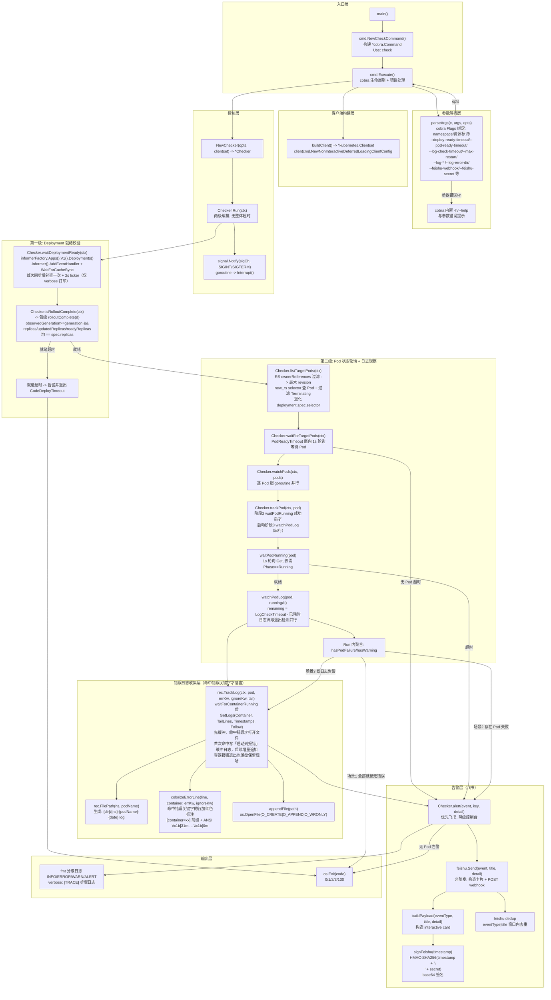
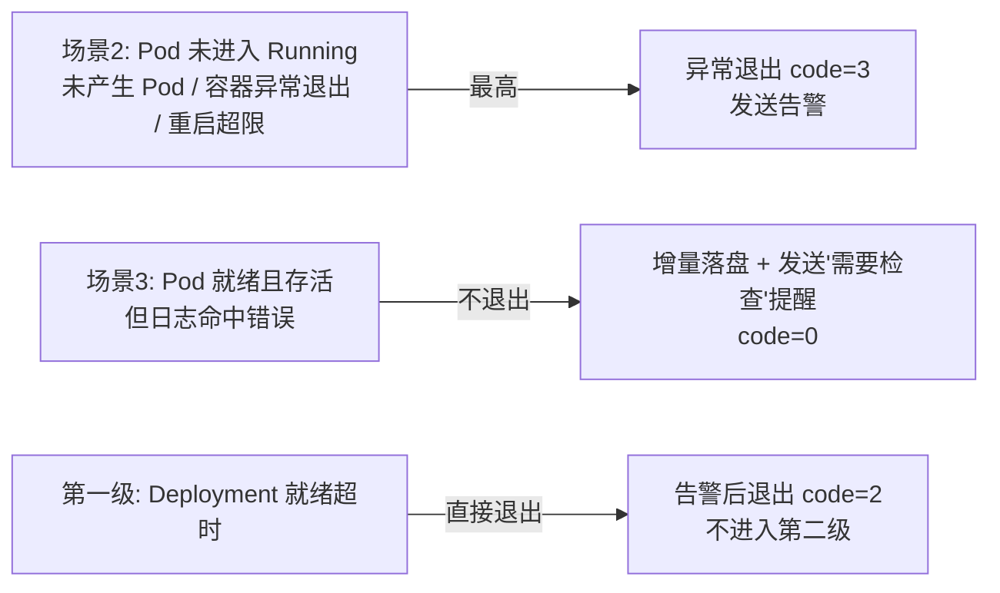

# kubectl-check 插件架构设计（规划图表）

> 本文档基于 `kubectl-check 插件设计规格说明书SPEC.md` 生成，用于流程图与函数/方法调用关系拓扑图审阅（对照当前代码）。
> 技术栈：client-go + cobra。第一级 Deployment 就绪采用 **informer 事件驱动**（对标原生 `kubectl wait`）；第二级 Pod 状态/退出检测采用 **1s 轮询**，日志采用 **Follow 流式长连接**。
>
> **两级独立检查（无整体超时）**：
> 1. 三段**独立**超时：`--deploy-ready-timeout`（Deployment 就绪）/ `--pod-ready-timeout`（Pod 状态）/ `--log-check-timeout`（日志观察）；
> 2. **第一级**：Deployment informer 在就绪超时内按 `rolloutComplete` 四条件判定（observedGeneration/updatedReplicas/readyReplicas 与 spec.replicas 对齐），超时未就绪则**告警后直接退出，不再进入下一级**（退出码 2）；
> 3. **第二级**：`waitForTargetPods` 前置等待目标 Pod → `waitPodRunning` 轮询 Pod 状态（超时独立）→ Running 后启动 `watchPodLog` 日志观察（日志流 + 退出检测并行，超时独立）；
> 4. **优先级 Pod 异常 > 日志告警**：
>    - 场景1：Pod 就绪且无错误日志 → 退出码 0；
>    - 场景2：Pod 未进入 Running / 未产生 Pod / 容器异常退出 / 重启超限 → 告警 + 异常退出（码 3）；
>    - 场景3：Pod 就绪但日志命中错误（Pod 存活）→ 日志窗口结束发送「需要检查」提醒（码 0，不退出）。

---

## 1. 整体执行流程图（Mermaid flowchart）

依据当前实现：参数初始化与校验（cobra）→ 构建客户端 → **第一级 Deployment informer 就绪检查（独立超时）** → 超时则告警并直接退出 → **第二级：waitForTargetPods 前置等待目标 Pod → 逐 Pod 串行「waitPodRunning 状态轮询 → watchPodLog 日志观察」** → 按优先级聚合场景（1/2/3）→ 结果输出与退出。无整体超时、无稳定窗口。

```mermaid
flowchart TD
    Start([kubectl check 调用<br/>cobra: cmd.Execute]) --> ParseArgs[解析参数 / 校验合法性<br/>cobra Flags 绑定 + RunE]
    ParseArgs -->|参数非法| Exit1[返回错误并退出 code=1]
    ParseArgs -->|参数合法| BuildClient[构建 K8s 客户端<br/>buildClient: rest.Config / Clientset]

    BuildClient --> DeployInformer[第一级: Deployment Informer<br/>waitDeploymentReady: AddEventHandler<br/>+ 首次缓存同步补查 + 2s ticker 仅 verbose]
    DeployInformer --> DeployReady{rolloutComplete?<br/>observedGeneration/updated/ready<br/>与 spec.replicas 四条件对齐}
    DeployReady -->|就绪| DiscoverPods[关联 Pod 自动发现<br/>listTargetPods: ReplicaSet 反查<br/>最大 revision new_rs selector<br/>过滤 Terminating]
    DeployReady -->|就绪超时| AlertDeploy[发送告警<br/>Deployment 就绪超时<br/>优先飞书, 降级控制台]
    AlertDeploy -->|直接退出 CodeDeployTimeout| DeployExit[退出: CodeDeployTimeout=2]

    DiscoverPods --> WaitPods[waitForTargetPods<br/>PodReadyTimeout 窗内 1s 轮询<br/>等待目标 Pod 出现] --> CheckPods{找到 Pod?}
    CheckPods -->|超时仍无 Pod| AlertNoPod[告警: 未产生任何 Pod<br/>EventPodStatus]
    AlertNoPod --> Result3[Result(code=3)]
    CheckPods -->|有 Pod| Parallel[第二级逐 Pod goroutine<br/>watchPods: 每 Pod 串行<br/>阶段2 状态轮询 → 阶段3 日志观察]

    Parallel --> PodWatch[阶段2: Pod 状态轮询<br/>waitPodRunning: 1s Get<br/>--pod-ready-timeout]
    PodWatch --> PodReady{在超时内进入 Running?}

    PodReady -->|否| Scenario2[场景2: Pod 未进入 Running<br/>alert EventPodStatus]
    Scenario2 --> AlertPod[发送飞书告警<br/>Pod 状态异常]
    AlertPod --> Result3

    PodReady -->|是| LogStream[阶段3: watchPodLog<br/>日志观察两路并行]
    LogStream --> LT[日志流: rec.TrackLog<br/>Follow 实时跟踪，命中错误关键字才落盘<br/>首次命中写「启动到报错」缓冲日志，后续增量追加<br/>容器报错退出也落盘保留现场]
    LogStream --> EX[退出检测: 1s ticker<br/>containerExitCode / totalRestartCount]
    EX -->|容器退出 exit!=0| AlertExit[alert EventContainerExit<br/>+ waitLogFlush 落盘] --> Result3
    EX -->|重启超限| AlertRestart[alert EventRestartLimit] --> Result3
    LT --> LogHit{errorHit?}
    LogHit -->|是| Scenario3Mark[场景3: 标记日志告警<br/>窗口结束 alert EventPendingCheck<br/>「需要检查」非阻塞]
    LogHit -->|否| Scenario1Chk{Aggregate 聚合<br/>watchPods goroutine 全部结束}
    Scenario3Mark --> Scenario1Chk

    Scenario1Chk -->|存在 Pod 失败| AlertAgg[alert EventContainerExit 聚合告警] --> Result3
    Scenario1Chk -->|仅日志告警| Result0b[Result(code=0)<br/>已发 EventPendingCheck]
    Scenario1Chk -->|全部正常| Result0[Result(code=0)]

    Result0 --> Cleanup[关闭日志流 / 释放缓存]
    Result0b --> Cleanup
    Result3 --> Cleanup
    Exit1 --> Cleanup
    Cleanup --> End([进程退出])
```

> 图中 `Result(code=?)` 为统一结果输出节点；场景3 的「需要检查提醒」在日志观察窗口结束后触发，属**非阻塞**动作，不影响退出码（返回 0）。

**异常终止优先级**：
- **Pod 异常（场景2：未进入 Running / 未产生 Pod / 容器异常退出 / 重启超限）> 日志告警（场景3）**：任一 Pod 失败即最终退出码 3；
- 场景3（Pod 已就绪但存在错误日志且存活）**不终止流程**，仅落盘 + 补发提醒，返回 0；
- 第一级 Deployment 就绪超时**直接终止流程**，告警并以退出码 2 退出，不再追踪 Pod。

---

## 2. 函数 / 方法调用关系拓扑图（Mermaid）

以 `main` 为根，标注各函数职责与 client-go 调用点。分层：入口层（cobra） / 参数解析层 / 客户端构建层 / 控制层 / 校验层 / 日志层 / **错误日志收集层（Follow 实时流增量追加写）** / **告警层（飞书）** / 输出层。



**关键 client-go / 三方调用点汇总**
- 命令行：`github.com/spf13/cobra`（`NewCheckCommand` / `cmd.Flags()` / `RunE`）
- 客户端：`clientcmd.NewDefaultClientConfigLoadingRules` + `clientcmd.NewNonInteractiveDeferredLoadingClientConfig` / `kubernetes.NewForConfig`
- Deployment 监听：`informerFactory.Apps().V1().Deployments().Informer().AddEventHandler` + `cache.WaitForCacheSync`
- Pod 发现：`clientset.AppsV1().ReplicaSets().List`（按 ownerReferences 过滤）+ `clientset.CoreV1().Pods().List`（按 new_rs selector / pod-template-hash；退化用 Deployment selector；过滤 DeletionTimestamp 非空）
- Pod 状态轮询：`clientset.CoreV1().Pods(ns).Get(ctx, name, metav1.GetOptions{})`（1s ticker，判断 `Status.Phase == Running`；退出检测判断容器 `State.Terminated` 与 `RestartCount`）
- 日志流（实时监控/关键字判断/条件落盘）：`clientset.CoreV1().Pods(ns).GetLogs(name, &PodLogOptions{Container, TailLines: --log-tail, Timestamps: true, Follow: true}).Stream(ctx)`（无 SinceTime 快照拉取；容器已退出时降级非 Follow + 独立短超时 ctx 拉历史日志）
- 缓存/生命周期：`informerFactory.Start(ctxTimeout.Done())` / `informerFactory.WaitForCacheSync`
- 错误日志落盘：标准库 `os.OpenFile(path, O_CREATE|O_APPEND|O_WRONLY)`（命中错误关键字才打开文件，写缓冲的「启动到报错」日志后增量追加 `fmt.Fprintln`）；未命中错误且未报错退出不产生文件
- 颜色标注：ANSI 转义码（红色 `\x1b[31m` / 复位 `\x1b[0m`）
- 飞书告警：`net/http` POST webhook + `crypto/hmac`（`--feishu-secret` 签名校验模式）

---

## 3. 异常终止优先级与退出码映射

### 3.1 异常终止优先级

无整体超时、无稳定窗口。优先级按「Pod 异常 > 日志告警」聚合判定：



- **Pod 异常（场景2）优先级最高**：只要存在一个 Pod 未进入 Running、未产生 Pod、容器异常退出或重启超限，即按场景2 处理（告警 + 异常退出 code=3）；即便同时有 Pod 命中错误日志，因「Pod 异常 > 日志告警」也按场景2；
- **场景3（Pod 已就绪且存活但存在错误日志）不终止流程**：命中错误关键字日志已落盘，窗口结束后发送「需要检查」提醒，返回 code=0；
- **第一级 Deployment 就绪超时直接终止流程**：告警后以退出码 2 退出，不进入第二级 Pod 追踪。

### 3.2 退出码映射

| 退出码 | 含义 | 触发条件 |
| --- | --- | --- |
| 0 | 正常 | 场景1（Pod 就绪且无错误日志）或场景3（Pod 就绪且存活但存在错误日志，已落盘并提醒） |
| 1 | 参数/环境错误 | 参数非法、K8s 客户端构建失败、waitForTargetPods 查询失败（cobra RunE 返回错误） |
| 2 | Deployment 就绪超时 | `rolloutComplete` 四条件在 `--deploy-ready-timeout` 内未满足；**告警后直接退出（CodeDeployTimeout），不进入第二级 Pod 追踪**（目标 Deployment 不存在同样表现为第一级超时） |
| 3 | 场景2：Pod 异常 | 未产生任何 Pod / Pod 在 `--pod-ready-timeout` 内未进入 Running / 容器异常退出（exit code != 0）/ 重启超 `--max-restart`；异常退出 |
| 130 | 收到中断信号主动退出 | SIGINT/SIGTERM 触发 `Interrupt()`：取消上下文 → 等待收尾 → 发送 `EventInterrupted` 告警后退出，**不误报为业务错误** |

> 说明：
> - 三段超时常量独立：`--deploy-ready-timeout` / `--pod-ready-timeout` / `--log-check-timeout`，彼此互不影响，无顶层兜底超时；
> - 场景3「需要检查」提醒为**非阻塞通知**，在日志观察窗口结束后发送，**不改变最终退出码**（code=0）。

---

## 4. 错误日志落盘设计

### 4.1 文件命名与位置

- 文件名：`{namespace}-{podName}-{date}.log`（如 `delta-test-app-76b5f8d5c9-abc12-20260815.log`），date 格式 `20060102`，跨天自动切换新文件；
- 存放目录：`--log-error-dir` 指定（默认当前工作目录 `.`），目录不存在自动创建。

### 4.2 记录内容（命中错误关键字才落盘）

- 文件记录该 Pod **命中错误关键字时"从日志起点（含 --log-tail 回溯）到报错行"的日志**，便于复盘完整错误现场与上下文；未命中错误且未报错退出的正常应用**不产生日志文件**；
- 日志来源：Pod 进入 Running 后调用 `GetLogs(&PodLogOptions{Container, TailLines: --log-tail, Timestamps: true, Follow: true}).Stream(ctx)` 开启流式读取，`--log-tail`（默认 100）回溯容器近期日志；未命中错误前**内存缓冲**（环形缓冲，容量随 --log-tail 放大），首次命中错误时把缓冲日志一次性落盘，此后**逐行增量追加**；
- **错误行红色标注**：命中 `--log-err-keywords` 的行用 ANSI 转义码 `\x1b[31m`（红色）包裹、行尾 `\x1b[0m` 复位，其余行保持默认色；文件为文本 `.log`，终端 `cat`/`tail` 查看即可见红色错误行；
- 忽略规则（`--log-ignore-keywords`）命中的行**不标注红色**（不作为错误行，不触发落盘）；
- 容器异常退出（exit code != 0）但日志未命中关键字：**仍把缓冲日志落盘保留现场**（走独立短超时 ctx 非 Follow 拉取），并附带告警。

```
[2026-08-15T10:00:00+08:00] [container=app] INFO starting server :8080
[2026-08-15T10:00:02+08:00] [container=app] INFO heartbeat ok
[2026-08-15T10:00:03+08:00] [container=app] \x1b[31mlevel=ERROR msg="connection refused" err="dial tcp ..." (red line)\x1b[0m
[2026-08-15T10:00:04+08:00] [container=app] \x1b[31mpanic: nil pointer dereference (red line)\x1b[0m
```

### 4.3 增量追加写机制（O_APPEND，新旧错误共存）

- 日志流开启后，`rec.TrackLog` 对采集到的行先**内存缓冲**；**首次命中错误关键字**时通过 `appendFile`（`O_CREATE|O_APPEND|O_WRONLY`）打开 `namespace-podname-date.log`，将缓冲的「启动到报错」日志一次性写入，错误行标红；
- 文件打开后，同 Pod 后续新日志按时间顺序**持续增量追加**到同一文件，多次命中错误均增量更新，历史错误与新错误**同时保存在同一文件中**，无需重复拉取；
- 未命中错误且容器未报错退出：**不打开文件、不落盘**（正常应用无日志文件产生）。
- 追加写失败仅记录 warning，不影响主流程判定；日志流结束/窗口到期时 flush 后关闭文件。

### 4.4 与飞书告警联动

- 日志观察期间（`watchPodLog`）：`rec.TrackLog` 命中错误关键字 → 标记 `errorHit` + 该行标红落盘，**不发送告警**；
- 日志窗口结束（`--log-check-timeout` 到期，场景3）：若 `errorHit` → `setWarning()`，最终聚合时 `alert(EventPendingCheck, ...)` 发送「需要检查」提醒（消息文案：`{pod} 存在错误日志，但 Pod 已就绪，需要检查` + 日志文件路径），**非阻塞，不影响退出码（code=0）**；
- 容器异常退出/重启超限（`alertPodExit`）：`cancelLog()` 停止日志流 → `waitLogFlush`（5s 兜底）等待落盘收尾 → `setPodFailure()` → `alert(EventContainerExit / EventRestartLimit)`（code=3，附错误日志文件路径）；
- 场景2（Pod 未进入 Running）的告警类型=Pod 状态异常（`EventPodStatus`，code=3），优先飞书、未配置则降级控制台。

---

## 5. 飞书告警设计

### 5.1 触发事件与阻塞性

| 事件类型 | 触发时机 | 阻塞性 | 消息内容要点 |
| --- | --- | --- | --- |
| Deployment 就绪超时 | 第一级：`rolloutComplete` 四条件超时 | **阻塞（告警后退出 code=2，不进入第二级）** | 资源标识、等待超时时长、四条件未满足说明 |
| Pod 状态异常 | 第二级：未产生任何 Pod / Pod 在 `--pod-ready-timeout` 内未进入 Running | 阻塞（code=3） | Deployment 标识、Pod 名称与未就绪原因 |
| 容器异常退出 | 容器 `Terminated` 且 `exitCode != 0` | 阻塞（code=3） | Deployment 标识、Pod 名称、退出码、容器名、错误日志文件路径 |
| 重启次数超限 | 容器 `restartCount` 超 `--max-restart` | 阻塞（code=3） | Deployment 标识、Pod 名称、重启次数与阈值 |
| **日志需检查（提示）** | **场景3：Pod 已就绪且存活但日志命中错误** | **非阻塞（code=0）** | **「{pod} 存在错误日志，但 Pod 已就绪，需要检查」+ 错误日志文件路径** |
| 检查被中断 | 收到 SIGINT/SIGTERM | 阻塞（code=130） | 提示检查被中断 |

> 注：日志错误命中**不直接发送告警**，仅标记 errorHit + 标红落盘；Pod 随后容器退出/重启超限时发对应阻塞告警（code=3）；Pod 存活则于日志窗口结束后发「需要检查」提示（code=0）。Pod 异常优先级更高，即便同时命中错误日志也按 Pod 异常处理。

### 5.2 消息格式与发送

- 使用飞书自定义机器人 `interactive`（消息卡片）格式：`header` 按事件类型着色（red 异常 / orange 提示），`elements` 用 `lark_md` 输出资源标识、命名空间、事件详情、错误日志文件路径、时间戳；
- Webhook 通过 `--feishu-webhook` 指定，非空即启用告警；`--feishu-secret` 开启飞书签名校验模式（`HMAC-SHA256(timestamp+"\n"+secret)` 后 base64）；
- **未配置 Webhook 降级控制台输出**：当 `--feishu-webhook` 为空时，所有本应推送飞书的告警事件均**降级为控制台直接打印**（`[ALERT][事件类型] 标题 + 详情` 格式），同样受去重窗口约束；不影响退出码与判定逻辑；
- 发送采用**独立 goroutine + 短超时（如 3s）**，发送失败仅记录 warning，**不影响主流程判定与退出码**；
- 去重：`eventType|title` 键在去重窗口（`--feishu-dedup-window`，默认 30s）内仅发送一条，避免重复推送。

---

## 6. 参数清单（v0.6，供拓扑图函数签名参考）

| 参数 | 作用 | 默认值 |
| --- | --- | --- |
| `-n / --namespace` | 目标命名空间 | default |
| 位置参数 `类型/名称` | 监控资源（当前仅 deployment） | 用户必传 |
| `--deploy-ready-timeout` | 第一级：Deployment 就绪超时（秒级），`<=0` 禁用 | 300 |
| `--pod-ready-timeout` | 第二级：Pod 状态就绪超时（秒级，含目标 Pod 出现等待） | 120 |
| `--log-check-timeout` | 第二级：每 Pod 日志观察窗口（秒级），`<=0` 禁用 | 60 |
| `--max-restart` | Pod 最大允许重启次数，`0` 表示禁用该检查 | 0（禁用） |
| `--check-pod-status` | Pod 状态强校验开关 | true |
| `--log-enable` | 实时日志监控开关 | true |
| `--log-err-keywords` | 日志异常关键字（逗号分隔） | error,panic,fatal,exception,crash |
| `--log-ignore-keywords` | 忽略的无害日志关键字 | 空 |
| `--log-tail` | 回溯读取日志行数 | 100 |
| `--log-error-dir` | 错误日志落盘目录（文件名 `namespace-podname-date`，错误行红色标注，Follow 流增量追加写） | `.`（当前目录） |
| `--feishu-webhook` | 飞书机器人 Webhook 地址，非空启用告警 | 空（默认不启用，降级控制台） |
| `--feishu-secret` | 飞书签名校验密钥（可选） | 空 |
| `--feishu-dedup-window` | 同事件告警去重窗口（秒级） | 30 |
| `-v / --verbose` | 详细日志输出（[TRACE] 步骤日志） | false |
| `-h / --help` | 帮助文档 | - |

> 命令行框架：`github.com/spf13/cobra`（新增依赖）。三段超时相互独立、无整体超时。
